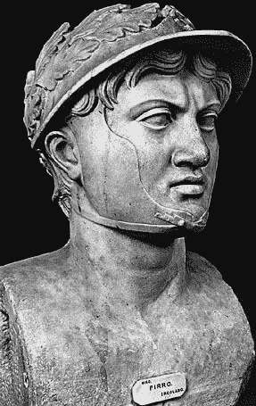

<!--yml

分类：未分类

日期：2024-05-18 15:46:27

-->

# VIX and More: CNBC 百万美元投资挑战：#41,667

> 来源：[`vixandmore.blogspot.com/2007/05/cnbc-million-dollar-portfolio-challenge_02.html#0001-01-01`](http://vixandmore.blogspot.com/2007/05/cnbc-million-dollar-portfolio-challenge_02.html#0001-01-01)

有些日子，你可以用“嗯……本来可以更糟……”这样的想法来安慰自己。昨天，那种特别的安慰对我来说并不是一根可以抓住的稻草，因为我在[i2 Technologies (ITWO)](http://finance.google.com/finance?q=athr&hl=en)上的“全仓”赌注变成了在整个纽约证券交易所、美国交易所和纳斯达克股票中跌幅最大的股票。损失相当惨重，让我从顶部的 0.1%跌落到顶部的 3%。

关于 ITWO 收益的[可怕细节](http://yahoo.reuters.com/news/articlehybrid.aspx?storyID=urn:newsml:reuters.com:20070501:MTFH10799_2007-05-01_15-01-31_BNG178117&type=comktNews&rpc=44)归结为显著的收益失误；维护收入的下降（通常意味着客户对软件不满意）；以及 57 岁的首席执行官退休的消息——董事会对“开始寻找替代者”的评论。

在这个过程中，发生了一些有趣的事情。最明显的一个是，我的[收益激增潜力算法](http://vixandmore.blogspot.com/search/label/earnings%20spike%20potential%20algorithm)必须被视为一个巨大的成功，因为它的[最后两个选择](http://vixandmore.blogspot.com/2007/05/cnbc-million-dollar-portfolio-challenge.html)取得了令人印象深刻的收益，另一家它高度评价的股票 ITWO，昨天显示出令人印象深刻的波动，尽管是在错误的方向上。是的，这是一个[皮洛士胜利](http://en.wikipedia.org/wiki/Pyrrhic_victory)，但也许将来会带来一些真正的金钱回报。

另一个方面是情感上的。我从未尝试过模拟交易，也不推荐那些想要学习交易的人尝试。ITWO 变成了一个完美的案例研究。昨天它让我损失了五十万美元，我的反应主要是对于损失规模的娱乐。显然，CNBC 美元的娱乐价值远远超过了投资组合的价值。

如果这些都是真实世界的美元，我可能昨天会为 ITWO 的跳空下跌而痛苦，希望有个反弹（是的，我知道你不应该让“希望”进入你的交易计算中），然后在日内走势没有反转的情况下减少我的损失。至少我认为我会这样做。实际上，太多投资者，特别是经验不足的投资者，坚持这些恐怖故事，并疯狂寻找任何能证明他们本能反应的信息——持有不放，这种模式在几小时、几天、几周甚至有时几个月内反复出现。

在没有美元风险或情感牵涉到持有 ITWO 的情况下，我在交易结束时毫无仪式地抛售了它（在这场竞赛中不允许日内交易）并寻找另一个潜在的高飞股。今天我的 CNBC 美元正骑在[Amkor 技术（AMKR）](http://finance.google.com/finance?q=amkr&hl=en)的公交车上；虽然 AMKR 对我的*[投资组合 A1](http://vixandmore.blogspot.com/search/label/Portfolio%20A1)*投资组合做了奇迹，但今天它上涨了 1%，与更广泛市场的收益一致。

嘿，至少我没有宣称：“<城市 st="on"><地点 st="on">任务</地点></城市>完成...”
