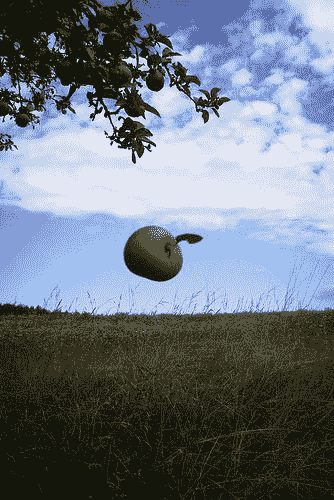

<!--yml

类别：未分类

date: 2024-05-18 15:46:05

-->

# VIX and More：CNBC 百万美元投资组合挑战：#61,448

> 来源：[`vixandmore.blogspot.com/2007/05/cnbc-million-dollar-portfolio-challenge_03.html#0001-01-01`](http://vixandmore.blogspot.com/2007/05/cnbc-million-dollar-portfolio-challenge_03.html#0001-01-01)

谁把重力调高了？

就好像周二[i2 Technologies (ITWO)](http://finance.google.com/finance?q=athr&hl=en)的[-30.2%下跌](http://vixandmore.blogspot.com/2007/05/cnbc-million-dollar-portfolio-challenge_02.html)还不足以让我谦卑，昨天[Amkor Technology (AMKR)](http://finance.google.com/finance?q=amkr&hl=en)又把我的投资组合再减少了 1.9%。 为了保险起见，今天的选择[Open Text (OTEX)](http://finance.google.com/finance?q=otex&hl=en)，目前下跌了 4.5%。

不知何故，我设法留在了[1,594,583 名参赛者](http://www.cnbc.com/id/18466880)的前 4％中，他们突然在我后视镜中变得更加庞大。

我真的无法指责[收益潜力算法](http://vixandmore.blogspot.com/search/label/earnings%20spike%20potential%20algorithm)，因为它昨天的首选，[Charter Communications (CHTR)](http://finance.google.com/finance?q=chtr&hl=en)，目前交易上涨超过 3%。 在这样的比赛中，其中一半的乐趣在于放手一搏，而不是听从你的选股系统告诉你该做什么——这正是我今天打算再次做的。

对于那些担心我对 CNBC 美元的漫不经心，你可能会稍微欣慰地知道，我正在玩弄一种新型止损，所谓的*行为止损*。 但是，请不要在[Investopedia](http://www.investopedia.com/search/results.aspx?q=behavioral+stop&submit=Go)上寻找这个术语，因为我刚刚编造出来的。 我将行为止损定义为“度量触发器，旨在迫使个人停止继续重复特定自毁性投资行为的路径。” 例如：如果我掉出了前 10％，那么我就停止玩波动性轮盘。

现在，让我们看看今天晚间谁要报告…
