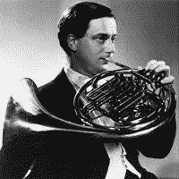

<!--yml

分类：未分类

日期：2024 年 5 月 18 日 15:47:40

-->

# VIX and More：CNBC 百万美元投资组合挑战赛：前 0.1%

> 来源：[`vixandmore.blogspot.com/2007/04/cnbc-million-dollar-portfolio-challenge_26.html#0001-01-01`](http://vixandmore.blogspot.com/2007/04/cnbc-million-dollar-portfolio-challenge_26.html#0001-01-01)

好吧，所以我没在[亚马逊（AMZN）](http://finance.google.com/finance?q=amzn&hl=en)发布财报前购买，并错失了昨天轻松获得 27%收益的机会。然而，我仍然取得了一些进展，[VECO](http://finance.google.com/finance?q=veco&hl=en)的收益超过了可观的 2.9%。

我的投资组合现已增至 169 万美元，但在[CNBC 百万美元投资组合挑战赛](http://vixandmore.blogspot.com/search/label/CNBC%20Million%20Dollar%20Portfolio%20Challenge)中以 293 万美元位列第十名，前方的任务依然艰巨。积极的一面是，在[1,324,502 名参赛选手](http://www.cnbc.com/id/18328716)中，我至少可以宣称进入了前 0.1%。

随着比赛的进行，我发现需要一个*收益潜力爆发*算法，并花了一些时间测试和完善这样的算法。昨天，在收盘前，它挑选出了三家公司，这些公司在报告收益后的交易后可能出现高波动性。好消息是，该算法（比赛结束后我将很乐意讨论）为今天产生了三个高波动性的交易：[SWKS](http://finance.google.com/finance?q=swks&hl=en)（东部夏令时中午后上涨 21%）；[HLIT](http://finance.google.com/finance?q=hlit&hl=en)（下跌 15%）；和[ARBA](http://finance.google.com/finance?q=arba&hl=en)（下跌 9%）。在这三个中，我最关注 SWKS，最终却放弃了这个选择，以及另外两个。虽然波动性的潜力确实存在，但我担心它更可能朝着错误的方向。相反，我选择了一个稍微不太波动的交易，它在收益前的增长中显示出了更多的动力：[GSI Commerce（GSIC）](http://finance.google.com/finance?q=gsic&hl=en)，其零售电子商务解决方案帮助交付了一个足够[好](http://biz.yahoo.com/prnews/070425/new055.html?.v=3)的季度，以克服[两家分析师的下调](http://finance.yahoo.com/q/ud?s=GSIC)早上将股票打压下来的情况。今早开盘下跌 5.3%后，该股票已经上涨 4%。

现在到了吹嘘部分的帖子。对于那些错过 CNBC 聚会的人，过去我在这里吹嘘自己的时候，我会利用这个机会来突出我最喜欢的号角演奏家之一。首先介绍两位爵士小号手：[ Clifford Brown](http://vixandmore.blogspot.com/search/label/Clifford%20Brown); 和 [Lee Morgan](http://vixandmore.blogspot.com/search/label/Lee%20Morgan)。今天我想将我的注意力转向古典音乐和[Dennis Brain](http://en.wikipedia.org/wiki/Dennis_Brain)，他可能是现代史上最杰出的受过古典训练的号角演奏家。如果你不确定你是否是古典音乐的粉丝，你欠自己一个机会去找到一种方式来让你的耳朵欣赏[Brain 1953 年演奏的莫扎特号角协奏曲](http://www.amazon.com/Mozart-Horn-Concertos-Nos-1-4/dp/B00000GCAD)。如果你发现这是你生活中的一个转变性的体验，别说我没有警告你。
