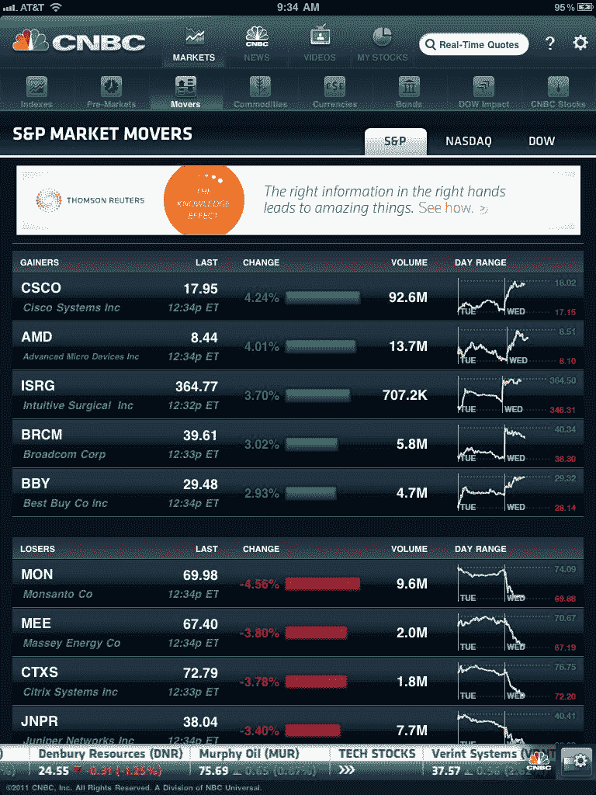

<!--yml

类别：未分类

日期：2024-05-18 16:52:09

-->

# VIX and More: CNBC Real-Time for the iPad

> 来源：[`vixandmore.blogspot.com/2011/04/cnbc-real-time-for-ipad.html#0001-01-01`](http://vixandmore.blogspot.com/2011/04/cnbc-real-time-for-ipad.html#0001-01-01)

由于关于[iPad](http://vixandmore.blogspot.com/search/label/iPad)上的交易应用的信息供需失衡（供应少，需求多），我决定花点时间深入研究这些应用。

首先是[CNBC Real-Time for iPad](http://itunes.apple.com/us/app/cnbc-real-time-for-ipad/id398018310?mt=8)，该应用提供大量内容，从市场数据和图表到新闻和视频。对于主要目标是当他或她不在办公桌前时监控市场的投资者来说，这个应用是一个很好的选择。市场数据不仅包括股票和主要市场股指，还包括商品、货币和债券。正如应用名称所示，报价是实时更新的，甚至还包括一个单独的 Pre-Markets 标签，提供股指期货数据。下面的图表显示了菜单结构和可用的各种标签。在屏幕截图中，我选择突出显示“市场> 移动 > 标普”数据。一个类似的标签“道指影响”列出了对道琼斯工业平均指数影响最大的五只股票及其每只股票的影响点数。

看看其他功能，新闻和视频内容正如您所期望的 CNBC：高质量、内容丰富且及时。

对于投资组合监控，My Stocks 内容为每个观察列表条目汇集了图表、新闻和视频。图表使用实时纳斯达克和纽约证券交易所数据，便于比较一个证券与各种指数的多样性，以及使用移动平均线（SMA、EMA、WMA）、[布林带](http://vixandmore.blogspot.com/search/label/Bollinger%20bands)、MACD、RSI、DMI 等技术指标以及其他几个指标。总之，市场技术人员在这里会得到很好的服务，尽管能够定制技术指标的默认设置会更好。缺少的一项能力是输入股份和成本基础信息，这样投资者可以轻松地跟踪他们持有证券的美元价值变化。

即使有这些小缺点，总的来说，CNBC Real-Time for iPad 是一个非常适合那些希望远程监控市场并且不需要直接从他们的市场监控平台进行交易的优秀“一站式”应用。当然，这并不会阻止人们在同时保留他们最喜欢的基于经纪商的应用程序，并且也成为机会主义的交易者。

相关文章：

*[图片：CNBC Real-Time for iPad]*

****披露：*** *无*
