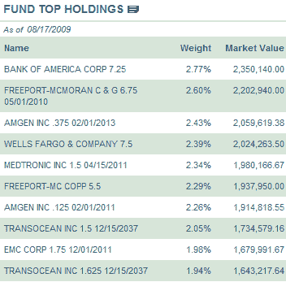
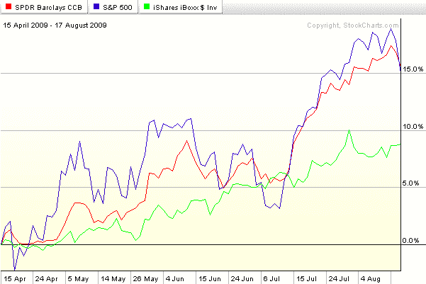

<!--yml

分类：未分类

日期：2024 年 5 月 18 日 17:33:22

-->

# VIX and More: CWB: A New(ish) Convertible Bond ETF

> 来源：[`vixandmore.blogspot.com/2009/08/cwb-new-convertible-bond-etf.html#0001-01-01`](http://vixandmore.blogspot.com/2009/08/cwb-new-convertible-bond-etf.html#0001-01-01)

我从未特别喜欢[可转换债券](http://vixandmore.blogspot.com/search/label/convertible%20bonds)，但是这些投资有时确实很有意义。

在四个月前推出（根据我的扭曲的 ETF 编年史，仍然符合“新”的资格），[SPDR 巴克莱资本可转换债券 ETF](https://www.spdrs.com/product/fund.seam?ticker=CWB)（[CWB](http://vixandmore.blogspot.com/search/label/CWB)）旨在跟踪巴克莱资本美国可转换债券>$500MM 指数的价格和收益表现。

右侧表格显示了 ETF 昨日收盘时的前三大持仓，包括美国银行（[BAC](http://vixandmore.blogspot.com/search/label/BAC)）、自由港 - 麦克莫兰（[FCX](http://vixandmore.blogspot.com/search/label/FCX)）和安进（[AMGN](http://vixandmore.blogspot.com/search/label/AMGN)）。同样的当前前十大持仓快照可以在[此处](https://www.spdrs.com/product/fundFullPage.seam?ticker=CWB)找到。

自 4 月 16 日 CWB 上市以来，这只 ETF 的牛市表现几乎与 SPX 步调一致，但波动性较低。在下图中，CWB 由红线表示，SPX 为蓝色，而 iShares iBoxx $ 投资级企业债券 ETF（[LQD](http://finance.yahoo.com/q?s=lqd)）则显示为绿色。这张图几乎完美地说明了为什么可转换债券 ETF（或封闭式基金或共同基金）可以成为投资组合的有力补充。在牛市中，可转换债券的表现最佳，其上行与股票可比拟，但下行风险较小。在通常情况下，即非趋势性市场或熊市中，拥有不升值的期权所需的低收益和费用使可转换债券不如标准债券。

当然，精通期权的投资者可能希望购买自己的债券 ETF，并精选自己喜欢的期权策略，但对于那些希望放弃定制方法，坚持使用现成产品的人来说，CWB 目前至少是唯一一个胜任的 ETF。

*[图表：StockCharts]*
