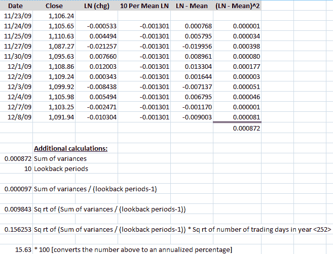
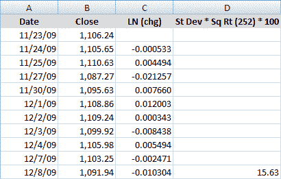

<!--yml

分类：未分类

日期：2024-05-18 17:20:44

-->

# VIX 和更多：计算中心化和非中心化历史波动率

> 来源：[`vixandmore.blogspot.com/2009/12/calculating-centered-and-non-centered.html#0001-01-01`](http://vixandmore.blogspot.com/2009/12/calculating-centered-and-non-centered.html#0001-01-01)

昨天在[什么是历史波动率？](http://vixandmore.blogspot.com/2009/12/what-is-historical-volatility.html)一文中，我试图简要概述历史波动率（HV）并将其放入更广泛的波动率背景下。

今天我将努力回答关于历史波动率我最常收到的问题：它到底是如何计算的？

你可能会认为计算是一件简单的事情，但实际上并非如此。尽我所能用简单的英语说明（由于我没有掌握 Word 的方程编辑器），计算历史波动率的步骤如下：

1.  选择一个期望的交易日回顾期*（回顾期）*

1.  收集完整回顾期内的收盘价格，再加上一天*（回顾期+1）*

1.  计算回顾期内每个交易日证券的收盘价变动*（每日变动）*

1.  计算每个日常百分比变动的自然对数*（每日变动的自然对数）*

1.  计算回顾期内收盘价格的自然对数平均值*（回顾期收盘价格的自然对数平均值）*

1.  对于每一天，从日常变动的自然对数中减去回顾期平均值*（日常差异）*

1.  将平均值与每日变动的差值平方*（每日方差）*

1.  将所有差值的平方相加*（方差之和）*

1.  将方差之和除以回顾期*（回顾期方差）*

1.  计算回顾期内的历史波动率*（历史波动率，表示为标准差）*的平方根

最后，要将标准差转换为年度波动率百分比，请将表示为标准差的历史波动率 HV 乘以一年中的交易日数（大约 252 天）的平方根，然后乘以 100 *（历史波动率）。*

一个 Excel 示例将有助于说明步骤和计算。下面的表格使用了过去十一个交易日的 SPX 收盘数据。第二行在 A 列有 11/24/09 的日期，B 列有 1105.65 的收盘价，C 列是 11/24 的收盘价除以 11/23 的自然对数[=LN (b3:b2)]。D 列是 C 列自然对数的平均值[=average (c3:c12)]，而 E 列简单地从 C 列减去 D 列[=c3-d3]。最后，F 列平方 E 列的结果[=e3²]，F13 单元格则求和所有平方值[=sum(f3:f12)]。

在主要表格下面的计算首先在 A16 重复 F13 的值[=f13]，并在 A17 声明回顾期的数量。在 A19，A16 除以 A17 [=a16/a17]。A21 然后取 A19 的结果的平方根[=a19¹/2]。A23 将 A21 的结果乘以 252 的平方根[=a21*sqrt(252)]。最后但并非最不重要的是，A25 将 A23 的结果转换为百分比[=a23*100]，得出 10 日历史波动率为 15.63。

要复制整个表格，只需将第 3 行的公式复制到表格的底部，有一个例外。这个例外是 D 列，在整个表格中重复的是平均值——而不是公式。

如果这似乎是得出历史波动率值所需进行的大量计算，还有一种更简短且稍有不同的方法——我相信这种方法为交易员生成更好的数字。

上述计算反映了一个中心方法，其中日常价格变化是相对于整个周期的平均值来衡量的。看待同一个问题的另一种方式是假设在长期内，价格的平均变化趋近于零，并且没有意义。作为一个推论，如果平均值没有意义，就没有理由从日常变化中减去它，所以所有涉及平均值的计算都可以省略。这就是计算历史波动率的非中心方法，有时也被称为“摒弃平均值”。

下面的结果表格要容易管理得多，也更容易理解。前三列（日期、收盘价和每日价格变化的自然对数）与上面相同。第四列只需计算每日价格变化的自然对数的标准差，乘以一年中交易日的平方根（252），并通过乘以 100 将其转换为年度波动率百分比。因此，下面单元格 d12 的公式简单的是=stdev(c3:c12)*sqrt(252)*100。这个公式现在可以复制到下面的行中，以计算随后的历史波动率值。注意，与中心方法不同，除了主要表格中的计算外，不需要进行任何额外的计算。

在这里，非中心方法也得到了 10 日历史波动率为 15.63 的结果。

接下来的部分，我将详细解释一些公式的含义，以及它们如何被修改，并解释交易员为什么可能更喜欢非中心的历史波动率数据而不是中心的历史波动率数据。

关于历史波动率，读者可以查阅以下内容：

****披露：*** *无*
