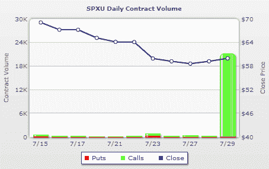

<!--yml

分类：未分类

日期：2024-05-18 17:36:18

-->

# VIX 和更多：SPXU 看涨期权交易量激增

> 来源：[`vixandmore.blogspot.com/2009/07/call-volume-spikes-in-spxu.html#0001-01-01`](http://vixandmore.blogspot.com/2009/07/call-volume-spikes-in-spxu.html#0001-01-01)

由于我一直在讨论的[SPXU](http://vixandmore.blogspot.com/search/label/SPXU)似乎已经引起了人们对 SPX 对三倍 ETF（SPXU 是-3 倍 ETF，而[UPRO](http://vixandmore.blogspot.com/search/label/UPRO)是+3 倍 ETF）的浓厚兴趣，我认为今天早上 SPXU 看涨期权的交易量激增应该被记录下来。

正如[WhatsTrading.com](http://whatstrading.com/)下面的图表所显示，交易前两小时 SPXU 中交易超过 20,000 份看涨期权，表明一些大型赌注正在将 SPX 的三倍 ETF 期权市场作为投资场所。这并不令人惊讶，因为我在最近的文章《三倍 ETF 期权市场概览》中确认了在几个三倍 ETF 对中（包括金融([FAS](http://vixandmore.blogspot.com/search/label/FAS)和[FAZ](http://vixandmore.blogspot.com/search/label/FAZ))、小盘([TNA](http://vixandmore.blogspot.com/search/label/TNA)和[TZA](http://vixandmore.blogspot.com/search/label/TZA))、大盘([BGU](http://vixandmore.blogspot.com/search/label/BGU)和[BGZ](http://vixandmore.blogspot.com/search/label/BGZ))以及新兴市场([EDC](http://vixandmore.blogspot.com/search/label/EDC)和[EDZ](http://vixandmore.blogspot.com/search/label/EDZ))）中进行了大量期权交易。

今天大宗的 SPXU 交易是 20,961 份 12 月 75 美元的看涨期权，似乎是以询价价格成交的，表明有买家对-3 倍 ETF 表现出了兴趣。

这次交易是投机行为还是对冲操作无法确定，但由于与价格衰减相关的所有问题，我发现期权还有五个月的时间很是有趣。

来源：[WhatsTrading.com]

**披露**：撰写本文时持有 SPXU。
