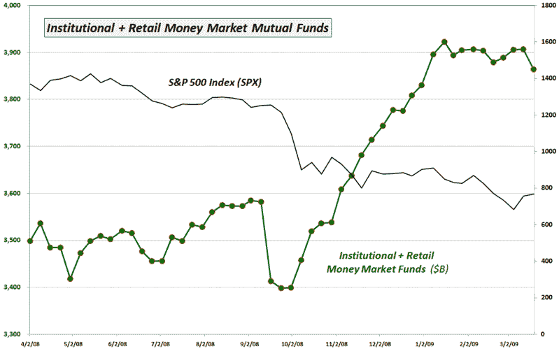

<!--yml

分类：未分类

日期：2024-05-18 17:54:25

-->

# VIX and More: Cash on the Sidelines Headed Back to Stocks?

> 来源：[`vixandmore.blogspot.com/2009/03/cash-on-sidelines-headed-back-to-stocks.html#0001-01-01`](http://vixandmore.blogspot.com/2009/03/cash-on-sidelines-headed-back-to-stocks.html#0001-01-01)

两个月前，在[图表一周：现金持仓趋势的变化？](http://vixandmore.blogspot.com/2009/01/chart-of-week-change-of-trend-in-cash.html)一文中，我发布了一张基于投资公司协会（ICI）计算的货币市场共同基金现金水平的图表，当我得出结论，这张图表可能指向[现金在边际](http://vixandmore.blogspot.com/search/label/cash%20on%20the%20sidelines)的趋势顶部时，引起了相当大的讨论。

快进到现在，根据同一图表的更新版本显示，1 月中旬货币市场共同基金现金水平的下降确实标志着趋势变化的开始，至少根据 ICI 数据来看。

事实上，上周的数据，截止周三，显示货币市场共同基金现金水平在过去六个月中最大跌幅。

随着货币市场和债券利率都在下降，我不会感到惊讶，看到更多的资金流回股市，因为替代投资变得不那么有吸引力。

*[source: Investment Company Institute, VIX and More]*
