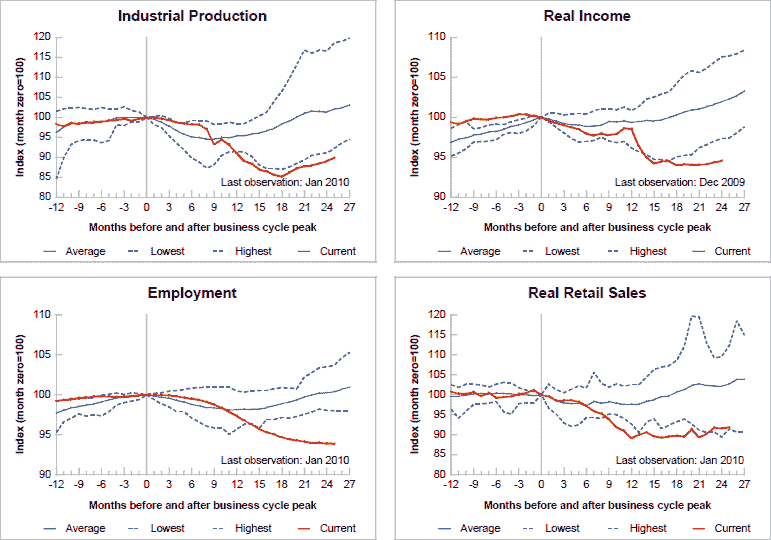

<!--yml

分类：未分类

日期：2024-05-18 17:15:15

-->

# VIX and More：美国经济复苏的更广泛视角

> 来源：[`vixandmore.blogspot.com/2010/02/chart-of-week-broader-look-at-us.html#0001-01-01`](http://vixandmore.blogspot.com/2010/02/chart-of-week-broader-look-at-us.html#0001-01-01)

上周，在[每周图表：零售销售复苏](http://vixandmore.blogspot.com/2010/02/chart-of-week-retail-sales-recovering.html)中，我试图证明备受折磨的美国消费者实际上在经济复苏中是相对强势的来源。

在本周的[每周图表](http://vixandmore.blogspot.com/search/label/chart%20of%20the%20week)中，我的目标是将对经济活动的相对狭窄视角扩展到跨越经济活动广泛范围的四个关键衰退指标上：[工业生产](http://vixandmore.blogspot.com/search/label/industrial%20production)；收入；就业；和[零售销售](http://vixandmore.blogspot.com/search/label/retail%20sales)。

请注意，相对于以往的复苏，通常在顶部之后约 8-12 个月出现底部，当前的复苏在 62 年的就业和实际收入数据中是迄今为止最弱的。工业生产显示出最为明显的反弹，但仍然是 62 年来最为疲弱的反弹。四项指标中唯一超过历史最低水平的是零售销售-然而即使在这里，幅度也是很小的。

这些数据难题所暗示的相当简化的问题是，零售销售和工业生产是否将拉动收入和就业，还是弱势的就业和收入趋势将拖累零售销售和工业生产。

为了比较，看一下[八个月前相同数据的图表](http://vixandmore.blogspot.com/2009/06/chart-of-week-four-key-economic.html)可能会很有趣。

关于相关主题的更多信息，读者被鼓励查看：

*[来源：圣路易斯联邦储备银行]*

***披露：*** *无*
