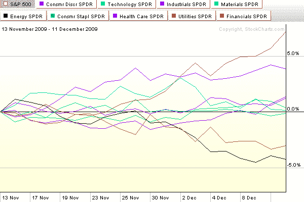

<!--yml

分类：未分类

date: 2024-05-18 17:20:12

-->

# VIX and More: Chart of the Week: A Month of New Sector Leadership

> 来源：[`vixandmore.blogspot.com/2009/12/chart-of-week-month-of-new-sector.html#0001-01-01`](http://vixandmore.blogspot.com/2009/12/chart-of-week-month-of-new-sector.html#0001-01-01)

在过去的一个月或两个月里，股市一直在横盘整理，缺乏买入信心和强有力的领导。

在本周的[图表](http://vixandmore.blogspot.com/search/label/chart%20of%20the%20week)中，我追踪了过去一个月内九个 AMEX[板块](http://vixandmore.blogspot.com/search/label/sectors)[SPDR](http://vixandmore.blogspot.com/search/label/SPDRs)的表现。注意，之前的领导者金融([XLF](http://vixandmore.blogspot.com/search/label/XLF))和能源([XLE](http://vixandmore.blogspot.com/search/label/XLE))现在正在落后，而防守型板块如公用事业([XLU](http://vixandmore.blogspot.com/search/label/XLU))和医疗保健([XLV](http://vixandmore.blogspot.com/search/label/XLV))正在引领市场。我对公用事业和医疗保健没有意见，但这些板块下次引领显著的牛市行情将是我记忆中的第一次。科技([XLK](http://vixandmore.blogspot.com/search/label/XLK))、消费者 discretionary([XLY](http://vixandmore.blogspot.com/search/label/XLY))、材料([XLB](http://vixandmore.blogspot.com/search/label/XLB))或或许金融需要扮演领导角色，以给下一轮牛市行情提供 portfolio managers 可以信赖的力量。

良好的防守或许能赢得冠军，但它不会激发潜在买家的热情。

关于相关主题的更多信息，读者可以查阅：

**[source: StockCharts]*

****披露：*** *无***
