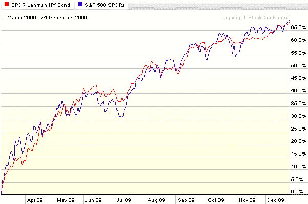

<!--yml

分类：未分类

日期：2024-05-18 17:18:59

-->

# VIX and More: 图表一周：垃圾债券的不可思议一年

> 来源：[`vixandmore.blogspot.com/2009/12/incredible-year-for-junk-bonds.html#0001-01-01`](http://vixandmore.blogspot.com/2009/12/incredible-year-for-junk-bonds.html#0001-01-01)

到了回顾 2009 年并展望 2010 年的时候了。

回顾 2009 年，那些有幸在[3 月低点](http://vixandmore.blogspot.com/2009/03/spx-at-687-intermediate-bottom.html)入市并抓住机会的投资者已经能够利用标普 500 指数自那时以来的 68%的涨幅的大部分或全部。虽然股票在过去 9 个半月的时间里一直在飙升，但我敢打赌，许多投资者可能没有意识到，在大多数时间里，垃圾债券的表现与股票相当。

在本周的[图表](http://vixandmore.blogspot.com/search/label/chart%20of%20the%20week)中，下面我展示了 SPY（标普 500 指数交易型开放式指数基金）和[JNK](http://vixandmore.blogspot.com/search/label/JNK)几乎相同的走势，JNK 是一种垃圾债券交易型开放式指数基金，原名标普巴克莱资本高收益债券交易型开放式指数基金([持仓信息](https://www.spdrs.com/product/fund.seam?ticker=JNK))。令人惊讶的是，自 3 月 9 日股市触底以来，JNK 的走势与 SPY 步调一致，且波动性更小。

如果美国经济在 2010 年继续复苏，那么像 JNK 和[HYG](http://vixandmore.blogspot.com/search/label/HYG)这样的垃圾债券 ETF 可能会在未来与股市保持同步。至少，这些 ETF 为投资者提供了一些投资组合的多样化以及更小的波动性——尽管这些属于极度风险的资产类别。

有关相关主题的更多信息，读者可以查阅：

*[来源：StockCharts]*

*****免责声明：*** *本文作者持有上述股票或基金头寸的可能性极小，本文仅供参考，不构成投资建议*
