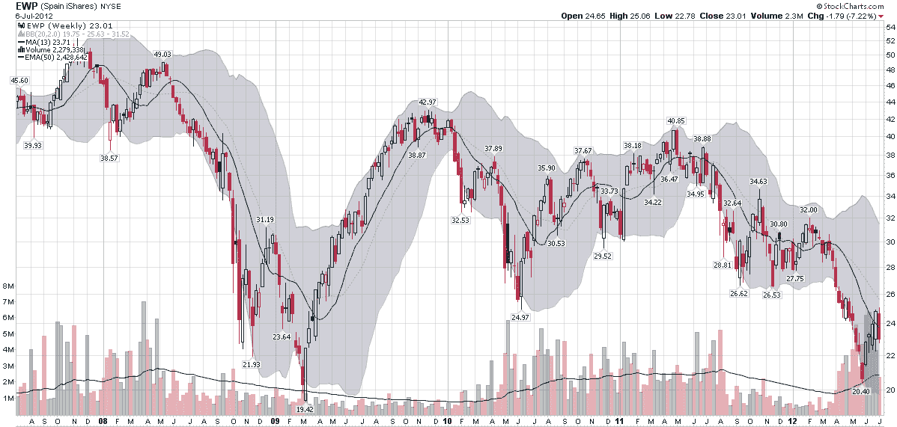

<!--yml

category: 未分类

date: 2024-05-18 16:26:35

-->

# VIX and More: Chart of the Week: As Goes Spain…

> 来源：[`vixandmore.blogspot.com/2012/07/chart-of-week-as-goes-spain.html#0001-01-01`](http://vixandmore.blogspot.com/2012/07/chart-of-week-as-goes-spain.html#0001-01-01)

两年前的今天，在[西班牙反弹](http://vixandmore.blogspot.com/2010/07/spain-rallies.html)中，我发布了一张西班牙 ETF[EWP](http://vixandmore.blogspot.com/search/label/EWP)的图表，显示 EWP 从低点反弹并看起来即将出现看涨突破。

2010 年 7 月，我认为西班牙是欧元区拼图的关键石：

> *“西班牙是我在欧元区主权债务危机中的临界点。简言之，西班牙若倒下，则欧洲也难独善其身。”*

两年后，我仍然认为西班牙是欧元区领导人必须应对的最重要的底线，也是命运与欧元未来最为紧密相连的国家。

The [chart of the week](http://vixandmore.blogspot.com/search/label/chart%20of%20the%20week) below shows weekly bars of EWP going back five years. The dominant feature in this chart is the financial crisis of 2008-2009\. Various iterations of the euro zone crisis can be identified in the bottoms in June 2010, September 2011, November 2011, etc. EWP was in a gradual downtrend from April 2011 to March 2012, but fell sharply until the beginning of June. The most recent bounce in the Spanish ETF still looks somewhat tentative on the charts and is likely to be tested in the weeks and months ahead.

尽管西班牙股市情况令人担忧，但该国的[信用违约互换](http://vixandmore.blogspot.com/search/label/credit%20default%20swaps)（距离历史高点仅 8%在 578）和主权债务收益率（10 年期债券收益率比历史高点低 5%在 6.95%）表明金融压力更大。

时不时地，我预计[意大利](http://vixandmore.blogspot.com/search/label/Italy)和[法国](http://vixandmore.blogspot.com/search/label/France)会重新回到寻求利用欧元区焦虑的交易者的目标清单上，但就我而言，西班牙将继续是最重要的底线。

Related posts:

**

*[source(s): StockCharts.com]*

***Disclosure(s):*** *none*
