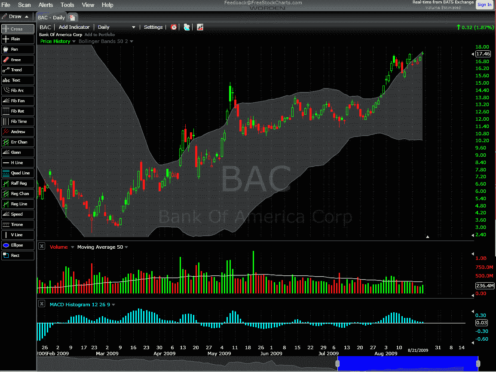

<!--yml

分类：未分类

日期：2024-05-18 17:32:22

-->

# 维克斯和更多：本周图表：BAC 的 FreeStockCharts.com 视角

> 来源：[`vixandmore.blogspot.com/2009/08/chart-of-week-bac-through-eyes-of.html#0001-01-01`](http://vixandmore.blogspot.com/2009/08/chart-of-week-bac-through-eyes-of.html#0001-01-01)

自从我上次在[本周图表](http://vixandmore.blogspot.com/search/label/chart%20of%20the%20week)中提到银行以来，几乎已经过去了六个月。因此，似乎关于鞭打死马的时效已经过去，我可以再次谈谈美国银行（[BAC](http://vixandmore.blogspot.com/search/label/BAC)）。

在过去几周里，许多交易员开始将美国银行作为他们的市场风向标，认为美国银行的情况如何，银行的情况也会如何，银行的情况如何，普通股票的情况也会如何。在很大程度上，这种推理是站得住脚的，任何利用美国银行来判断市场方向的人可能都已经做得很好。当然，那些在股票交易价格低于 4.00 时幸运地抓住一些 BAC 股票的投资者现在看到他们的原始投资在五个月内变成了五倍。

下面的图表也是我第一次在博客上使用来自[FreeStocksCharts.com](http://www.freestockcharts.com/)的图表。这个相对较新的网站是[Worden Brothers](http://www.worden.com/)的产物——这意味着它来自背后广受欢迎的 TeleChart 图表程序的同一群人。Worden Brothers 的另一个产品是[StockFinder](http://www.stockfinder.com/assets/StockFinder%204.0%20At%20a%20Glance.pdf)，如果你熟悉 StockFinder，那么你已经知道 FreeStockCharts.com，它类似于前者的在线化身。在图表中，我捕捉到了一些 FreeStockCharts.com 上可用的绘图工具（包括一些相当奇异的工具），还有 52 个可定制的指标（不仅仅是基本的），一个警报功能和其他一些有趣的功能。在投资的一个巨大的矛盾中，FreeStockCharts.com 还有一个[高级版本](https://www.worden.com/Products/FreeStockCharts/Premium)，费用与[StockCharts.com](http://stockcharts.com/)竞争。

作为一个 StockCharts 订阅者，要让我转到另一个图表程序需要付出很大的代价，但 FreeStockCharts.com 乍一看确实是一个很有吸引力的替代品。至少，它可以为博客提供不同的色彩方案和一组不同的指标...

对于一些相关帖子，可以尝试以下链接：

来源：[FreeStockCharts.com]
