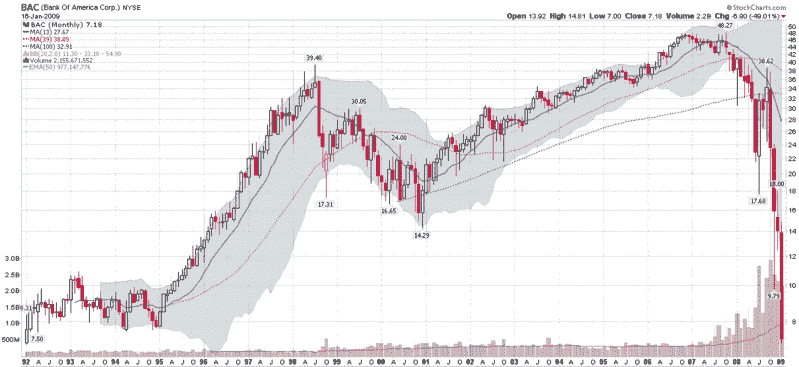

<!--yml

类别：未分类

日期：2024 年 05 月 18 日 18:05:23

-->

# VIX and More：美国银行摇摆不定的一周图表

> 来源：[`vixandmore.blogspot.com/2009/01/chart-of-week-bank-of-america-teeters.html#0001-01-01`](http://vixandmore.blogspot.com/2009/01/chart-of-week-bank-of-america-teeters.html#0001-01-01)

这对银行来说是一个艰难的一周，尤其是对于美国银行（[BAC](http://vixandmore.blogspot.com/search/label/BAC)）而言，该公司最近的困境使其成为了本周的[图表之星](http://vixandmore.blogspot.com/search/label/chart%20of%20the%20week)。

在这一周中，据透露由于对美林的一次错误收购和其他一些可疑举动，BAC ~~勒索了~~ 获得了 200 亿美元的秘密财政资助，以及高达 1180 亿美元的有毒资产担保。

贝尔斯登和雷曼兄弟已经成为了投资者愤怒的[标志性人物](http://vixandmore.blogspot.com/2008/03/lehman-brothers-leh-bounces.html)，但现在肯·刘易斯和美国银行面临的危险可能超过了他们祖辈的某些过度行为。

要么美国银行即将触底...要么我们正在目睹最后几家银行的倒塌，它们作为独立实体的存活可能能够阻止银行体系全面国有化。

下面的月度图表不仅显示了最近下跌的幅度，而且表明在某些方面，1 月份至少对于美国银行来说可能是迄今为止最糟糕的一个月。

*[来源：StockCharts]*
