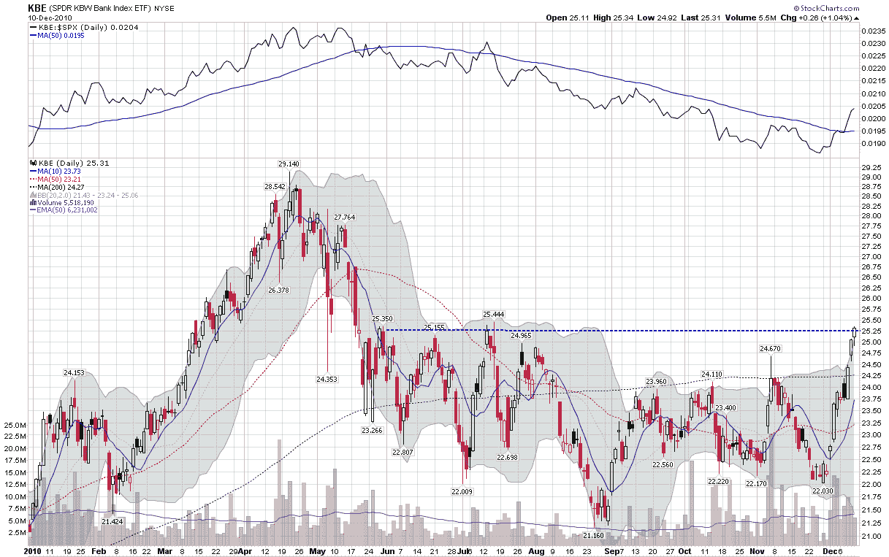

<!--yml

分类：未分类

日期：2024-05-18 16:56:40

-->

# VIX 和更多：本周图表：银行强劲上涨

> 来源：[`vixandmore.blogspot.com/2010/12/chart-of-week-banks-on-tear.html#0001-01-01`](http://vixandmore.blogspot.com/2010/12/chart-of-week-banks-on-tear.html#0001-01-01)

在过去一周的金融市场中存在许多复杂的因素，但其中一个主导主题是国债收益率的飙升。随着对利率预期的提高，银行也受到了提振。银行长期以来一直能够在伯南克导致的人为低利率下借款，现在银行在贷款方面的前景变得更好——随着利率开始上升，它们的贷款利差也随之扩大。

这些因素使得银行成为本周[本周图表](http://vixandmore.blogspot.com/search/label/chart%20of%20the%20week)的焦点。在下面的图表中，请注意，上面的研究显示银行在过去七个月里一直表现逊于标普 500 指数。然而，在最近一周，银行显示出剧烈的反转，这使得[KBE](http://vixandmore.blogspot.com/search/label/KBE)，这个流行的银行 ETF，突破了阻力线（虚线蓝色线条），并且扭转了超越大盘的趋势。

正如 2010 年一样，银行的表现将是 2011 年市场整体表现的关键因素。换句话说，银行将继续是一个关键的晴雨表，不仅反映全球增长，还反映各种经济体应对增长威胁的能力，例如主权债务和其他问题。

相关文章：

*[来源：StockCharts.com]*

***披露(s):*** *在撰写本文时持有 KBE*
