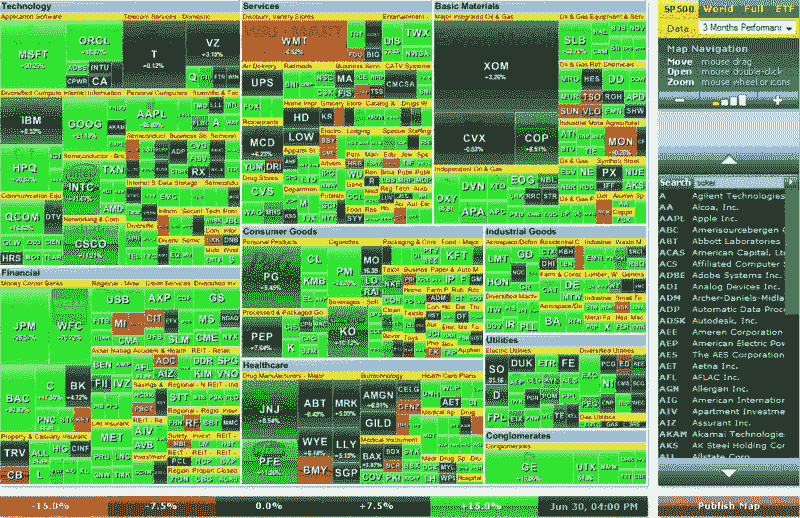

<!--yml

category: 未分类

date: 2024-05-18 17:40:16

-->

# VIX and More: 图表周报：分解第二季度标普 500 指数

> 来源：[`vixandmore.blogspot.com/2009/07/chart-of-week-breaking-down-s-500-in-q2.html#0001-01-01`](http://vixandmore.blogspot.com/2009/07/chart-of-week-breaking-down-s-500-in-q2.html#0001-01-01)

自“图表周报”特色推出以来，31 周过去了，除了我相信的其中两个图表外，我都创建了所有的图表。今后，我认为是时候稍稍放宽这个限制，扩大“图表周报”特色的范围，涵盖更广泛的主题，引入一些更多的视觉多样性等。

还有什么更好的方式来引入扩展的“图表周报”特色呢，但用标普 500 第二季度表现的热力图，特别是当该季度 15%的涨幅是指数 11 年来最好的。FINVIZ.com 的热力图分解了季度表现到成分股级别，按行业和板块分组，方块的大小与市值成比例，颜色代码（和数字）代表季度表现。

FINVIZ.com 提供了许多热力图，是一个值得探索的网站。

*[数据来源：FINVIZ.com]*
