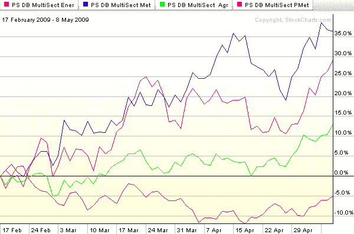

<!--yml

分类：未分类

date: 2024-05-18 17:48:05

-->

# VIX and More: 图表：打破近期商品市场的僵局

> 来源：[`vixandmore.blogspot.com/2009/05/chart-of-week-breaking-out-recent.html#0001-01-01`](http://vixandmore.blogspot.com/2009/05/chart-of-week-breaking-out-recent.html#0001-01-01)

本周的[图表](http://vixandmore.blogspot.com/search/label/chart%20of%20the%20week)关注[商品](http://vixandmore.blogspot.com/search/label/commodities)，其中基础金属（蓝线）和能源（红线）在 2 月中旬稍后再触底，大约在股市触底前 2 ½周。有趣的是，农业（绿线）在 3 月 2 日触底，就在股市找到底部之前。在经济增长紧张的时期，贵金属（紫线）走势与基础金属和能源截然不同，它在 11 月 12 日触底，并在 2 月 23 日达到近期高点，就在基础金属和能源开始反弹之际。

下表捕捉了自 2 月 17 日以来四个商品子行业 ETF 的表现。图表显示，在这段时间内，基础金属 ETF ([DBB](http://vixandmore.blogspot.com/search/label/DBB)) 表现最为强劲。尽管 DBB 在过去几天里有所动摇，但能源([DBE](http://vixandmore.blogspot.com/search/label/DBE))却出现了飙升。农业([DBA](http://vixandmore.blogspot.com/search/label/DBA))最近加入了牛市派对，随着对上升利率担忧的加剧，贵金属([DBP](http://vixandmore.blogspot.com/search/label/DBP))也开始反弹。

如果 3-4 个商品子行业 ETF 在今年余下时间超越标普 500 指数，我不会感到惊讶。至少，它们可以提供一些重要的投资组合多样化，并可能作为对冲通货膨胀的工具。

*[来源：StockCharts]*

***披露***：在撰写本文时持有 DBB。
