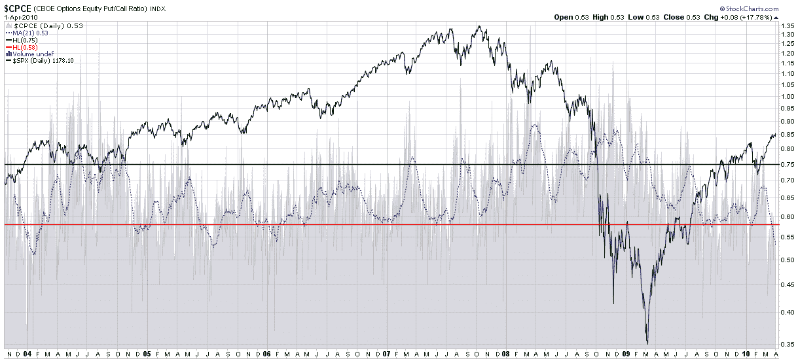

<!--yml

分类：未分类

日期：2024-05-18 17:12:07

-->

# VIX 和更多：本周图表：CBOE 月度股指看跌至看涨比率接近历史低点

> 来源：[`vixandmore.blogspot.com/2010/04/chart-of-week-cboe-monthly-equity-put.html#0001-01-01`](http://vixandmore.blogspot.com/2010/04/chart-of-week-cboe-monthly-equity-put.html#0001-01-01)

出于交易目的，我比较忠实地遵循 CBOE 股指看跌至看涨比率（[CPCE](http://vixandmore.blogspot.com/search/label/CPCE)）的 10 日指数移动平均（EMA）作为一个合适的平滑因子，来标记短期至中期摆动交易机会。然而，有时候一个更长期的移动平均，比如 21 日的简单移动平均，是更好用来识别看跌和看涨活动持续极端的工具。本周就是这样的一个场合。

下面的[本周图表](http://vixandmore.blogspot.com/search/label/chart%20of%20the%20week)查看了 CBOE 股指看跌至看涨比率的完整历史，该比率从 2003 年 10 月 21 日至今，并应用了一个 21 日的 SMA（虚线蓝色线）来生成我所说的月度股指[看跌至看涨](http://vixandmore.blogspot.com/search/label/put%20to%20call)比率。如图所示，低于 0.60 的读数通常是在长期头寸上获利了结和/或建立短期头寸的好时机。实际上，当前的 0.53 水平只在前一次出现，即 2004 年 1 月。那段时间恰好是在标普 500 指数触底并开始强劲牛市反弹之后的 13 个月。它也标志着股市在十个月下降之后，恢复了一场最终持续到 2007 年 10 月的反弹的起点。

当然，低股指看跌至看涨比率或涨势在 13 个月的上升后停滞不前并没有什么神秘之处，但是无论是多头还是空头都应该注意历史先例。

关于相关主题，读者们被鼓励去查看：

*[来源：StockCharts.com]*

***披露(s):*** *无*
