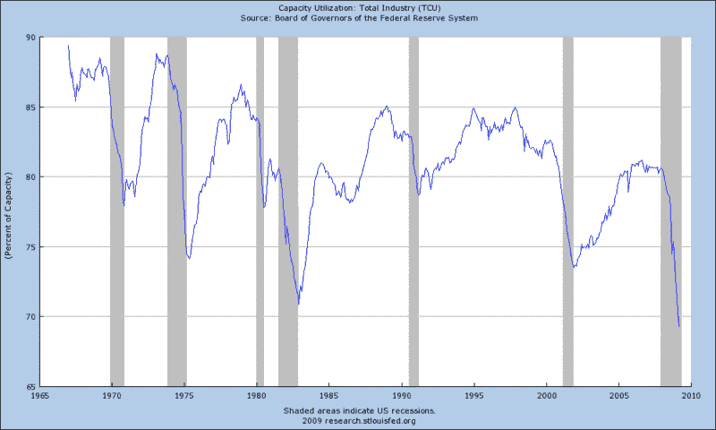

<!--yml

分类：未分类

日期：2024-05-18 17:51:23

-->

# VIX 和更多：本周图表：产能利用率创出新低

> 来源：[`vixandmore.blogspot.com/2009/04/chart-of-week-capacity-utilization-sets.html#0001-01-01`](http://vixandmore.blogspot.com/2009/04/chart-of-week-capacity-utilization-sets.html#0001-01-01)

我从 3 月 5 日以来一直持牛市态度([SPX 在 687 点；中期底部潜力高](http://vixandmore.blogspot.com/2009/03/spx-at-687-intermediate-bottom.html)),但过去几天里，许多因素使我的偏见又转向了熊市。

除了某些技术指标暗示当前股市过热外，最近有一波经济数据，其中大部分被忽略了，这些数据暗示看涨的标题可能很快就会减少。新闻范围从房屋开工到抵押贷款违约，从信用卡违约到零售销售和工业生产。坦率地说，这一切看起来都不太乐观。

与工业生产报告紧密相关的是[产能利用率](http://vixandmore.blogspot.com/search/label/capacity%20utilization)数据。本质上，这个统计数字衡量的是国家生产能力的多少正在被使用以及多少处于闲置状态。

这周的[本周图表](http://vixandmore.blogspot.com/search/label/chart%20of%20the%20week)查看了美国联邦储备系统可获得数据的全貌，3 月份的总产能利用率为 69.3%。这是这项统计系列历史上最低的数字，该系列数据可以追溯到 1967 年。虽然下面的图表没有显示，3 月份制造业产能利用率为 65.8%，这是自 1948 年开始记录以来的最低数字。

在解释产能利用率数据时，最好将这个数字视为相对于现有基础设施的需求的一个广泛度量。当然，目前创纪录的低数字反映了需求的历史性疲软。产能利用率也是通货膨胀和通缩压力的强有力预测指标。系统中存在如此多的松弛，通缩压力肯定会随着为了抵消大量闲置生产能力的固定成本而削减价格而增加。

除了当前的坏消息外，还有一些复杂的因素可能会使近期趋势难以扭转。展望未来，美元走强和消费者减弱对未来的生产数据并不利——应该引起对新通缩可能性的新的担忧。

工业生产可能吸引了大多数头条新闻，但产能利用率是经济拼图中被忽视的重要部分。

*[数据来源：联邦储备银行]*
