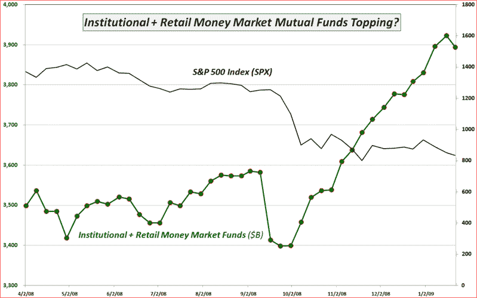

<!--yml

分类：未分类

日期：2024-05-18 18:03:42

-->

# VIX and More: 本周图表：现金持仓趋势的变化？

> 来源：[`vixandmore.blogspot.com/2009/01/chart-of-week-change-of-trend-in-cash.html#0001-01-01`](http://vixandmore.blogspot.com/2009/01/chart-of-week-change-of-trend-in-cash.html#0001-01-01)

尽管诱惑力可能很大，想要再贴一张金融板块([XLF](http://vixandmore.blogspot.com/search/label/XLF))、银行指数([BKX](http://vixandmore.blogspot.com/search/label/BKX))或某个似乎比同行表现得更加挣扎的单个银行的图表，但我上周的[本周图表](http://vixandmore.blogspot.com/search/label/chart%20of%20the%20week)就是这样做的，针对的是美国银行([BAC](http://vixandmore.blogspot.com/search/label/BAC))。本周的故事并没有太大变化，只是情况变得更糟了。

然而，现金持仓方面可能正在形成一个故事。根据投资公司协会的数据，从 2007 年 8 月至上周，货币市场共同基金的现金增长了超过 45%，达到了历史新高。下面的图表显示了自去年 10 月以来场外现金如何大幅增加，导致维持标普 500 指数上涨的燃料减少。在过去的一周，ICI 报告了自 9 月以来货币市场共同基金现金水平的首次实质性下降，同时也是过去 16 周中机构投资者现金水平下降的第二次。

如果上周货币市场共同基金水平的变动是趋势变化的第一迹象，那么这几乎肯定对股市的看涨有重大意义。

*[来源：投资公司协会，VIX and More]*
