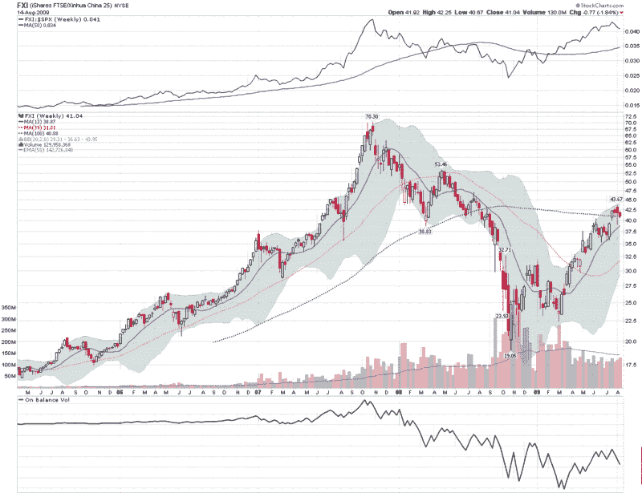

<!--yml

分类：未分类

日期：2024-05-18 17:33:37

-->

# VIX and More: 图表一周：通过 FXI 看中国

> 来源：[`vixandmore.blogspot.com/2009/08/chart-of-week-china-through-eyes-of-fxi.html#0001-01-01`](http://vixandmore.blogspot.com/2009/08/chart-of-week-china-through-eyes-of-fxi.html#0001-01-01)

2009 年最大的故事之一正迅速反弹的中国经济和中国股市。

第二季度，中国的 GDP 同比增长了 15%，工业生产同比增长了 10.8%。许多其他统计数据也显示，在最近刺激措施的实施后，中国经济强劲增长正在回归。此外，在最近季度的财报电话会议上，当被问及当前和未来的收入增长领域时，美国公司很快指出了中国强劲的反弹是少数或有时是唯一的增长领域。

因此，我选择了[FXI](http://vixandmore.blogspot.com/search/label/FXI)，即[iShares FTSE/Xinhua China 25 Index](http://www.ishares.com/product_info/fund/overview/FXI.htm)，作为本周的[图表](http://vixandmore.blogspot.com/search/label/chart%20of%20the%20week)。下面的图表是 FXI 自 2005 年 4 月以来的周线图，展示了 2006 年和 2007 年的剧幅上涨，2007 年 10 月至 2008 年 10 月的后续崩盘，以及从 10 月的低点反弹至 8 月 3 日高点的 129%。自顶部以来的两周里，FXI 下跌了约 6.4%。

在过去的的一年中，中国股市在美国股市之前触底，从底部反弹的幅度更大，并且在美国股市之前触顶。中国股市是否预示着调整？没有中国股市的创新高，美国股市能否继续创出新高？FXI 在 100 周移动平均线处的技术阻力是否会成为其重大障碍？我相信在劳动节到来之前，我们将有更好的答案来回答这些问题。

关于中国市场，我推荐以下两个优秀资源：

来源：[StockCharts]
