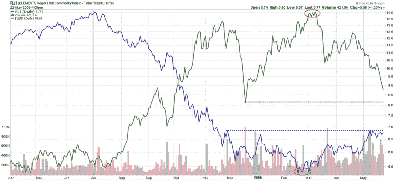

<!--yml

分类：未分类

日期：2024-05-18 17:46:08

-->

# 更多 VIX 信息：本周图表：大宗商品与美元

> 来源：[`vixandmore.blogspot.com/2009/05/chart-of-week-commodities-and-dollar.html#0001-01-01`](http://vixandmore.blogspot.com/2009/05/chart-of-week-commodities-and-dollar.html#0001-01-01)

本周影响市场的重大新闻之一是标准普尔公司将英国 AAA 级主权债务的展望从稳定下调至负面。此行动在货币市场引发连锁反应，投资者如 PIMCO 的比尔·格罗斯表达对美国不断增加的财政赤字和未来可能对美国债务 AAA 信用评级构成的风险的担忧后，美元承受压力。

截至本周末，美元对欧元汇率创四个月新低，[大宗商品](http://vixandmore.blogspot.com/search/label/commodities)价格大幅上涨，部分原因是投资者视大宗商品为对抗通胀的有效对冲工具。

在下面的[本周图表](http://vixandmore.blogspot.com/search/label/chart%20of%20the%20week)中，我捕捉到了罗杰斯国际大宗商品总回报指数 ETF ([RJI](http://vixandmore.blogspot.com/search/label/RJI)) 相对于美元的图表。图表显示，大宗商品于 2 月中旬触底，并最近吸引了更多买盘。

在大宗商品触底后不久，美元达到峰值并经历了几次剧烈的下跌。美元的下跌帮助推高了以美元计价的大宗商品价格，并促使资金流向大宗商品作为潜在的通胀对冲工具。在过去三个月的时间里，大宗商品经历了两个上升趋势期，每个之后都跟着一个震荡期。随着美元跌破支撑位并可能测试 12 月的支撑水平，大宗商品可能很快会迎来另一个上升趋势。

![source: StockCharts]
