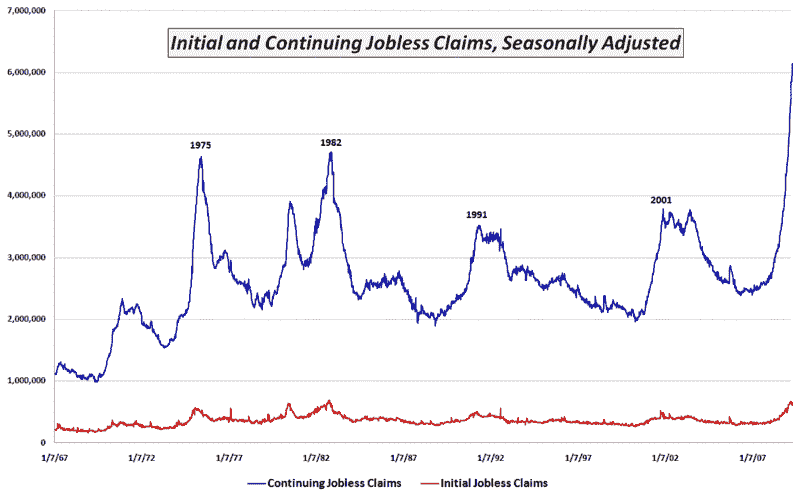

<!--yml

分类：未分类

日期：2024-05-18 17:50:27

-->

# VIX 和更多：本周图表：持续失业救济申请

> 来源：[`vixandmore.blogspot.com/2009/04/chart-of-week-continuing-jobless-claims.html#0001-01-01`](http://vixandmore.blogspot.com/2009/04/chart-of-week-continuing-jobless-claims.html#0001-01-01)

尽管经济花园中出现了一些绿色嫩芽，引发了一阵喧嚣，并且已知自初始[失业救济申请](http://vixandmore.blogspot.com/search/label/jobless%20claims)在四周前达到略低于 1982 年 10 月的记录水平以来，我想要提供一幅与更广泛报道的初始申请数据非常不同的持续失业救济申请的图片。

下方的[本周图表](http://vixandmore.blogspot.com/search/label/chart%20of%20the%20week)追踪了自 1967 以来的持续失业救济申请。尽管初始失业救济申请（红线）目前略低于 1982 年的记录水平，但持续申请救济（蓝线）已激增至比 1982 年水平高出超过 30%。

初始失业救济申请确实是一个重要问题，但目前更大的问题是现有失业工人很难找到新工作。不幸的是，在连续 12 周创下新纪录后，持续申请救济的趋势目前看不到任何放缓的迹象。

*[来源：劳工部]*
