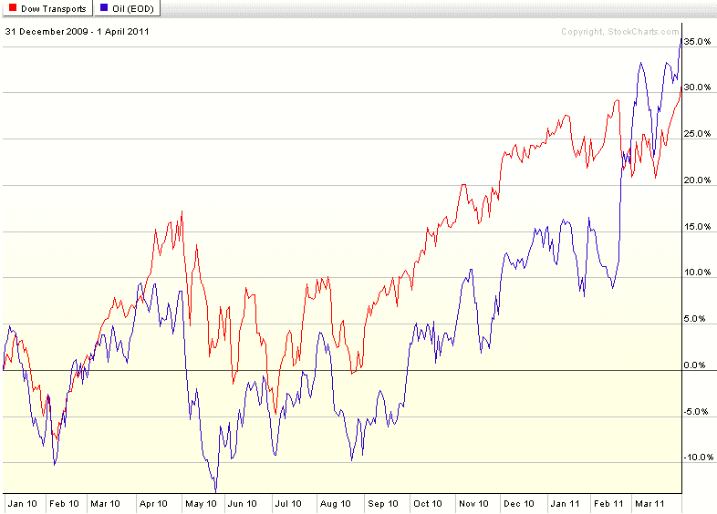

<!--yml

分类：未分类

日期：2024-05-18 16:52:23

-->

# VIX and More: 每周图表：原油与运输业

> 来源：[`vixandmore.blogspot.com/2011/04/chart-of-week-crude-oil-and-transports.html#0001-01-01`](http://vixandmore.blogspot.com/2011/04/chart-of-week-crude-oil-and-transports.html#0001-01-01)

在原油价格徘徊在每桶 108 美元的水平时，自然会开始想知道原油价格对股市会产生什么样的影响。

回顾近期历史，原油和股市之间存在正相关性，这主要是因为经济的改善带来了对原油需求的增加。当然，在某个时刻，原油价格的上升将会对 GDP 和股市产生拖累。对于原油对 GDP 影响的共识预测通常认为，每原油价格上涨 10 美元，美国 GDP 将下降约 0.25%。

原油和股市之间的负相关性是否会在 110 美元或更高水平开始显现还有待观察。

当原油价格开始对股市产生重大拖累时，首先可能会在运输行业显现出来。观察本周的[图表](http://vixandmore.blogspot.com/search/label/chart%20of%20the%20week)中自 2010 年以来[道琼斯运输平均指数](http://en.wikipedia.org/wiki/Dow_Jones_Transportation_Average)（[DJTA](http://vixandmore.blogspot.com/search/label/DJTA)）和（西德克萨斯州中级）原油价格，很明显原油价格与运输业的正相关性一直持续至今。尽管我预计这种正相关性很快就会结束，只要运输业与原油价格上涨同步上升，投资者应该对自己的股市多头仓位感到舒适。

相关文章：

来源：[StockCharts.com]*

***披露(s):*** *在撰写本文时持有原油期货合约***
