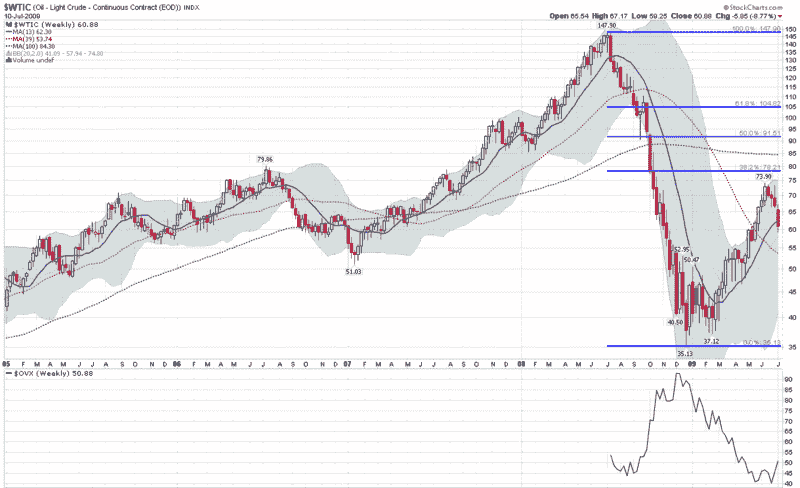

→yml

分类：未分类

日期：2024-05-18 17:38:52

→

# VIX 和更多：周图：原油和波动性

> 来源：[`vixandmore.blogspot.com/2009/07/chart-of-week-crude-oil-and-volatility.html#0001-01-01`](http://vixandmore.blogspot.com/2009/07/chart-of-week-crude-oil-and-volatility.html#0001-01-01)

在过去的一年里，虽然股票的波动幅度很大，但原油价格的波动更为剧烈。原油在昨天的 2008 年 7 月 11 日达到了 147.90 的高点，然而五个月后下跌了 76.2%，最低达到了 35.13。

下面的[周图](http://vixandmore.blogspot.com/search/label/chart%20of%20the%20week)捕捉了自 2005 年以来德克萨斯州中级原油价格的周变动。请注意，39 周移动平均（实红线），涵盖了三季度，与日常棒图中的经典 200 天移动平均非常接近。原油在 29 周前触底，因此，39 周（和 200 天）移动平均在未来 2-3 周内应开始上升，为这一商品提供技术支撑。

注意，石油波动率指数（[OVX](http://vixandmore.blogspot.com/search/label/OVX)）是在即将到来的周三满一周年，它反映了这段时间内原油价格的波动性。虽然在大盘动荡期间 VIX 从未达到 90，但 OVX 在 11 月达到了 103.54，目前为 50.88，比 VIX 高出 75%。

来源：[StockCharts](http://vixandmore.blogspot.com/search/label/source%3A%20StockCharts)
