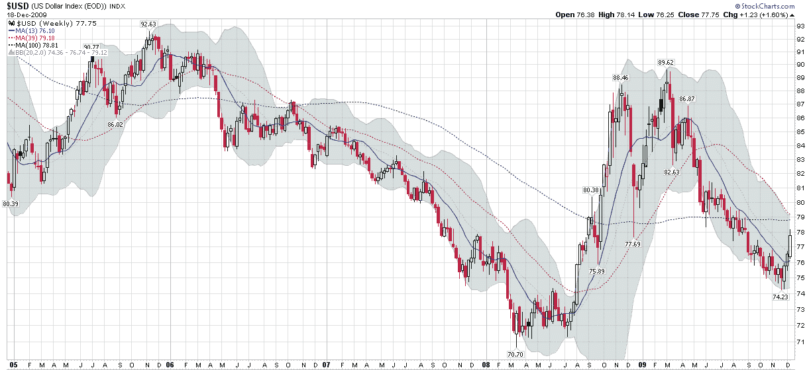

<!--yml

类别：未分类

日期：2024-05-18 17:19:39

-->

# VIX and More: Chart of the Week: Dollar Approaching Resistance on Weekly Chart?

> 来源：[`vixandmore.blogspot.com/2009/12/chart-of-week-dollar-approaching.html#0001-01-01`](http://vixandmore.blogspot.com/2009/12/chart-of-week-dollar-approaching.html#0001-01-01)

尽管我努力寻找除了[美元](http://vixandmore.blogspot.com/search/label/dollar)之外的东西来突出[本周图表](http://vixandmore.blogspot.com/search/label/chart%20of%20the%20week)，但我发现美元的故事太过吸引人，不容忽视。此外，考虑到本周的这张周线图应该反映我最近长时间思考的一个问题，我认为美元是 2010 年投资谜题的关键要素之一。

为了更好地了解美元，本周的图表周观察了美元指数的五年来周 K 线图，它将美元与包括[欧元](http://vixandmore.blogspot.com/search/label/euro)、日元[日元](http://vixandmore.blogspot.com/search/label/Yen)、英镑、加拿大元、瑞典克朗和瑞士法郎在内的外币加权平均篮子进行了比较。在这些货币中，欧元在篮子中的权重最大，约为 57.6%。因此，对[迪拜](http://vixandmore.blogspot.com/search/label/Dubai)、[希腊](http://vixandmore.blogspot.com/search/label/Greece)和[西班牙](http://vixandmore.blogspot.com/search/label/Spain)的担忧不仅显著削弱了欧元，而且由于欧元的权重，对美元指数产生了强烈的看涨影响。

下面的图表显示，美元指数的 79 水平代表了 39 和 100 周移动平均线的收敛形式所形成的阻力。图表中一个令人惊讶的特点是 100 周移动平均线，它在过去的 16 个月内一直坚守在 78 高位以上，即使是在金融危机期间美元指数大幅波动。如果美元收盘价超过 79 并突破两个移动平均线，我将不得不考虑它回到了看涨的轨迹。然而，目前，我更愿意将最近的变化视为由于一系列对欧洲经济及其货币的威胁而产生的技术性反弹。

有关相关主题的更多信息，读者们被鼓励去查看：

*[来源：StockCharts]*

***披露：*** *无*
