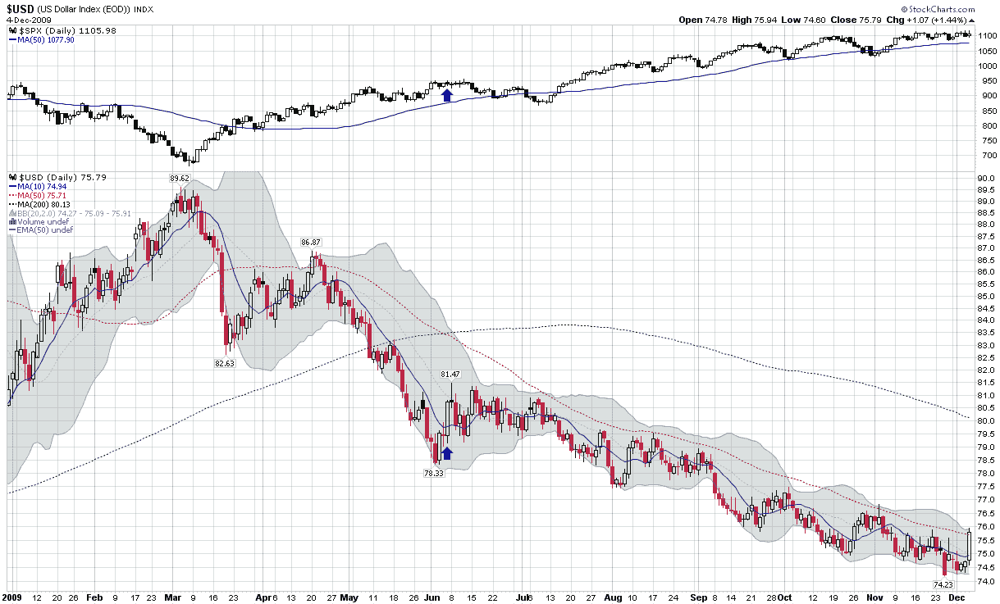

<!--yml

分类：未分类

date: 2024-05-18 17:20:59

-->

# VIX 和更多：本周图表：美元上涨？

> 来源：[`vixandmore.blogspot.com/2009/12/chart-of-week-dollar-rising.html#0001-01-01`](http://vixandmore.blogspot.com/2009/12/chart-of-week-dollar-rising.html#0001-01-01)

周五提醒我们，美元不会每天以有序、直线的方式下跌。实际上，会有美元大幅逆转的日子，让做空货币的交易员急于平仓，就像周五的 1.44%的涨幅一样。

在本文下面的[本周图表](http://vixandmore.blogspot.com/search/label/chart%20of%20the%20week)中，我追踪了自三月初开始的美元下跌和标普 500 指数的同步上涨。自那时以来，只有的一天美元涨幅超过了 1.44%。我用蓝色箭头标出了那一天，以强调尽管美元之前的大幅波动确实预示着货币的两周反弹和股票的四周下跌，但它并没有改变美元或股票的基本趋势。

当然，这次可能会有所不同。首先，美元收盘价自四月中旬以来首次突破 50 日均线。从技术角度来看，然而，我并不会对周五的上涨感到兴奋，除非它导致高于 77 的高点和高于 75 的低点。至少目前，当前的上涨应该被视为新空头加入美元套利交易派对的一个新的机会。

关于美元，读者们可以查阅以下内容：

*[source: StockCharts]*

****披露：*** *无**
