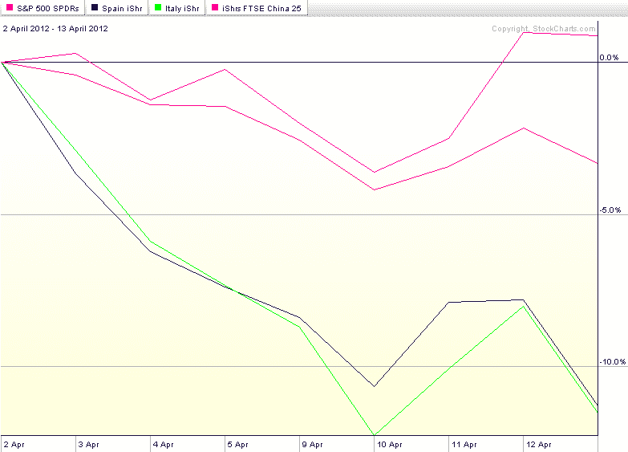

<!--yml

分类：未分类

date: 2024-05-18 16:32:40

-->

# VIX and More: 本周图表：不要责怪中国

> 来源：[`vixandmore.blogspot.com/2012/04/chart-of-week-dont-blame-china.html#0001-01-01`](http://vixandmore.blogspot.com/2012/04/chart-of-week-dont-blame-china.html#0001-01-01)

上周的财经头条被[西班牙](http://vixandmore.blogspot.com/search/label/Spain)和[中国](http://vixandmore.blogspot.com/search/label/China)所主导。在西班牙的情况下，这主要是因为西班牙银行从欧洲中央银行增加了借款。对于中国，罪魁祸首是 Q1 GDP 增长仅为 8.1%，低于 2011 年 Q4 的 8.9%，也远低于在周五宣布前一日流传的 9.0%的预期数字。事实上，许多人可能会认为，正是中国的 GDP 预期数字成为了周四的大幅上涨的主要催化剂，而这一上涨在周五基本上被逆转。

下方的[本周图表](http://vixandmore.blogspot.com/search/label/chart%20of%20the%20week)显示了 SPY 以及西班牙([EWP](http://vixandmore.blogspot.com/search/label/EWP)), [意大利](http://vixandmore.blogspot.com/search/label/Italy) ([EWI](http://vixandmore.blogspot.com/search/label/EWI))和中国([FXI](http://vixandmore.blogspot.com/search/label/FXI))自两周前股票触顶以来的表现。图表显示，尽管 SPY 在下降，但西班牙和意大利的 country ETFs 下降的速度大约是美国同行的三倍。那中国呢？好吧，不要怪中国是美国股市困境的原因。在美国股市下跌的同时，流行的[iShares FTSE/Xinhua China 25 Index](http://www.ishares.com/product_info/fund/overview/FXI.htm), FXI 的表现设法实现了 0.9%的上涨。

*[顺便说一下，大约一年前我停止了“本周图表”的更新，这个自 2008 年推出以来在这个领域非常受欢迎的功能，因为我的更新变得不规律。今后我希望能够继续我最近规律的更新，并使这成为一项不仅照亮过去一周的关键发展，也具有一定档案价值的周更 feature.]*

相关文章：

**

*[资料来源：StockCharts.com]*

***免责声明：*** *无*
