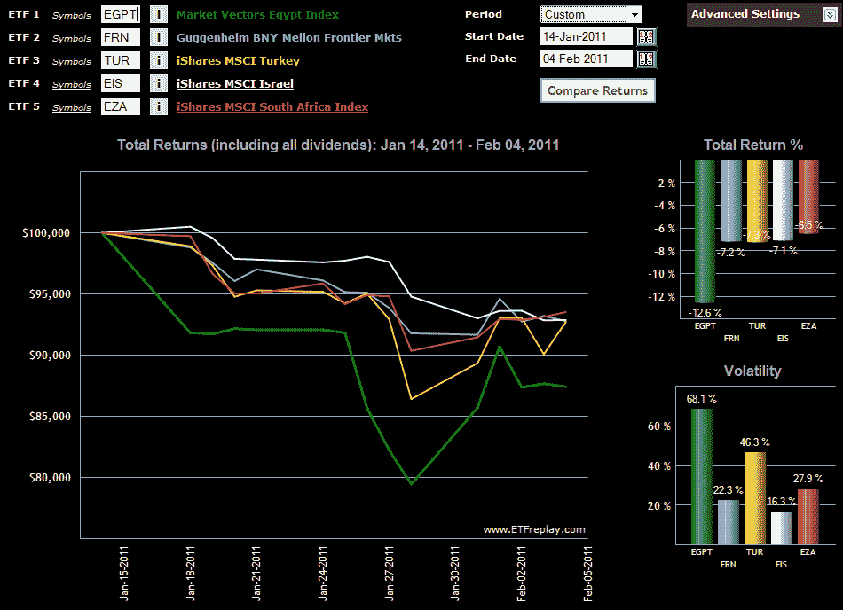

<!--yml

分类：未分类

日期：2024-05-18 16:53:27

-->

# VIX and More: Chart of the Week: EGPT and Collateral Damage

> 来源：[`vixandmore.blogspot.com/2011/02/chart-of-week-egpt-and-collateral.html#0001-01-01`](http://vixandmore.blogspot.com/2011/02/chart-of-week-egpt-and-collateral.html#0001-01-01)

埃及的[不安](http://vixandmore.blogspot.com/search/label/Egypt)仅仅三周大，而 already the 波及效应已经在全球范围内引起了几个波浪。

我发现区域和国家 ETF 在评估投资者在政治或经济方面的蔓延风险思考方式上有些帮助 - 至少在特定事件的范围和深度方面的经济影响。

在本周的[图表一周](http://vixandmore.blogspot.com/search/label/chart%20of%20the%20week)中，我努力追踪一些关注的地域分布的相对要素，使用几只 ETF。基准 ETF，[EGPT](http://vixandmore.blogspot.com/search/label/EGPT)，显示了在美国长周末（1 月 14 日至 1 月 18 日）期间情况如何恶化，然后在 1 月 26 日交易期间开始加速下行。

在影响方面，额外的四个 ETF 包括一个基于广泛的[前沿 ETF](http://vixandmore.blogspot.com/search/label/frontier%20ETFs)，[FRN](http://vixandmore.blogspot.com/search/label/FRN)，和三个单一国家 ETF：土耳其([TUR](http://vixandmore.blogspot.com/search/label/TUR)); 以色列([EIS](http://vixandmore.blogspot.com/search/label/EIS)); 和南非([EZA](http://vixandmore.blogspot.com/search/label/EZA)). 在这个团队中，土耳其 ETF 在危机期间证明是最具波动性的，并且也遭受了最大的跌幅。有趣的是，以色列 ETF 是这个团队中最稳定的，但唯一一个在 1 月 28 日没有找到底部并继续下行。这个团队中表现最好的是 EZA，南非 ETF。自危机开始以来，EZA 的跌幅超过了 EGPT 的一半，并在过去一周持续增强。 在国家 ETF 中，EGPT 和 TUR 是过去一周表现最好的两个。

请注意，有几个覆盖北非和中东地区的区域 ETF。我在[迪拜](http://vixandmore.blogspot.com/search/label/Dubai)危机期间在[前沿 ETF](http://vixandmore.blogspot.com/search/label/frontier%20ETFs)和[图表一周：市场 vectors 湾州 ETF (MES)](http://vixandmore.blogspot.com/2009/11/chart-of-week-market-vectors-gulf.html)中详细讨论了这些。

相关帖子：

*[来源：ETFreplay.com]*

****披露(s):*** *在撰写本文时持有 TUR*
