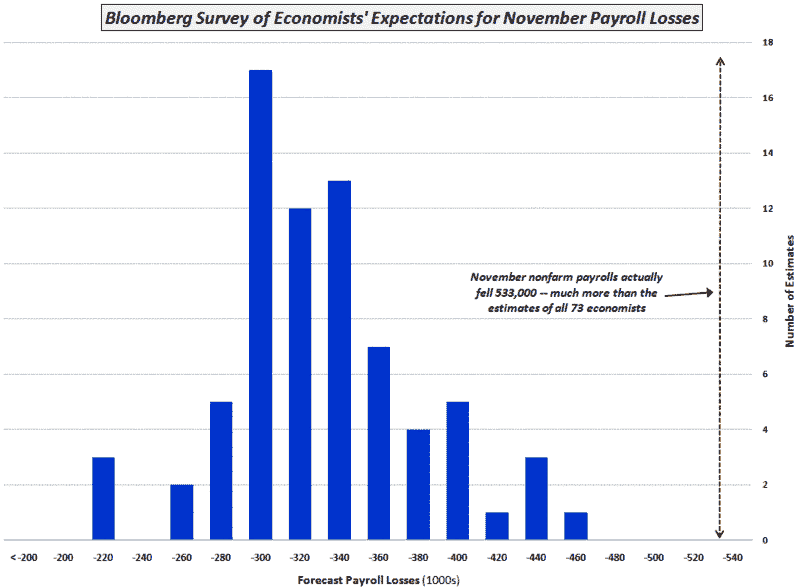

<!--yml

category: 未分类

date: 2024-05-18 18:12:23

-->

# VIX and More: Chart of the Week: Economists Try to Predict Payroll Losses

> 来源：[`vixandmore.blogspot.com/2008/12/chart-of-week-economists-try-to-predict.html#0001-01-01`](http://vixandmore.blogspot.com/2008/12/chart-of-week-economists-try-to-predict.html#0001-01-01)

今年的[关键词](http://www.merriam-webster.com/info/08words.htm)可能是救助，但在股市中，本周的关键词是弹性。

周二、周三以及周五再次，股市摆脱了坏消息和大幅下跌，实现了稳健的上涨。昨天取得的成就是所有中最令人印象深刻的，在 11 月[非农工资](http://vixandmore.blogspot.com/search/label/nonfarm%20payrolls)令最悲观的估计都感到震惊，[下降了 533,000](http://www.bls.gov/news.release/empsit.nr0.htm)之后。在就业数据发布后，道琼斯工业平均指数下跌了 292 点（3.5%），随后展开了猛烈的 638 点（7.9%）上涨，并最终以 259 点的上涨收盘，较周四收盘价上涨了 3.1%。

这周的[图表](http://vixandmore.blogspot.com/search/label/chart%20of%20the%20week)反映了 73 位经济学家[在接受彭博社调查](http://www.wealth.bloomberg.com/apps/news?pid=20601087&refer=home&sid=aty6I.l9.6Rs)时对就业报告发布前的工资预测。实际的非农工资人数为-533,000，比平均预测值的四倍标准差还要高，由右边的虚线黑线表示。鉴于这一结果引发了 3.1%的上涨，不禁让人思考如果就业数据接近中间值的 333,000 个损失或者甚至更加乐观的预测，在 220,000 个损失附近，股市会怎样。

展望未来，经济数据发布将在下周结束前保持清淡，但关注股市下周如何应对新闻流或许将很大程度上决定近期购买活动的特点。

*[source: Bloomberg, VIX and More]*
