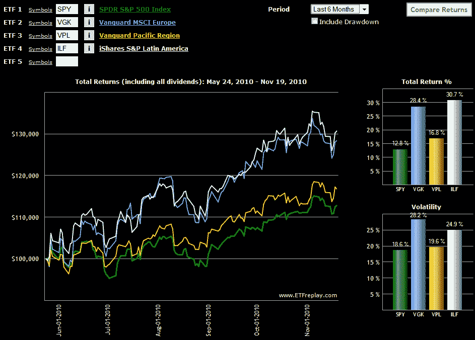

<!--yml

分类：未分类

日期：2024-05-18 16:58:22

-->

# VIX 和更多：本周图表：欧洲股市表现强劲

> 来源：[`vixandmore.blogspot.com/2010/11/chart-of-week-european-stocks-holding.html#0001-01-01`](http://vixandmore.blogspot.com/2010/11/chart-of-week-european-stocks-holding.html#0001-01-01)

六个月前，[欧洲主权债务危机](http://vixandmore.blogspot.com/search/label/European%20sovereign%20debt%20crisis)正处于高潮，我选择的[本周图表](http://vixandmore.blogspot.com/search/label/chart%20of%20the%20week)是[避险交易](http://vixandmore.blogspot.com/2010/05/chart-of-week-flight-to-safety-trade.html)。

随着周末欧盟和 IMF 对[爱尔兰](http://vixandmore.blogspot.com/search/label/Ireland)的救助计划展开，以及过去两周内对[希腊](http://vixandmore.blogspot.com/search/label/Greece)和[葡萄牙](http://vixandmore.blogspot.com/search/label/Portugal)在欧元区的未来也表示怀疑，这似乎是一个很好的时间来比较欧洲与其他大陆的表现。

尽管相对表现几乎总是取决于选取的起始日期，但我认为许多人仍然会对本周的图表感到惊讶，图表显示在过去六个月中，欧洲([VGK](http://vixandmore.blogspot.com/search/label/VGK))的表现与拉丁美洲([ILF](http://vixandmore.blogspot.com/search/label/ILF))相当，并明显优于亚洲([VPL](http://vixandmore.blogspot.com/search/label/VPL))和美国。如果欧洲能够在年底前不输给其他地区的 ETF，我认为该大陆应该可以松一口气，宣布至少在 2010 年取得胜利。

关于相关主题的更多信息，读者可以查阅：

***披露：*** *无*

*[来源：ETFreplay.com]*
