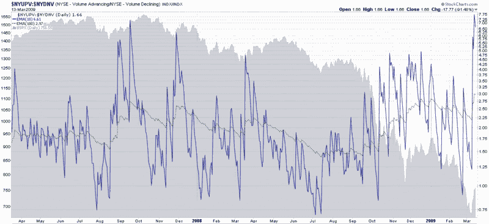

<!--yml

category: 未分类

date: 2024-05-18 17:55:35

-->

# VIX 和更多：本周图表：上涨成交量与下跌成交量的极端读数

> 来源：[`vixandmore.blogspot.com/2009/03/chart-of-week-extreme-readings-for-up.html#0001-01-01`](http://vixandmore.blogspot.com/2009/03/chart-of-week-extreme-readings-for-up.html#0001-01-01)

我尽可能地避免在本周再次发布关于银行或金融部门的图表，但即使间接地，也很难想到一幅与银行无关的图表。就这样吧。

本周的[本周图表](http://vixandmore.blogspot.com/search/label/chart%20of%20the%20week)是纽约证券交易所上涨股票与下跌股票成交量的比率图表。短期内这种数据有很多噪音，因此我使用了十日和 100 日指数移动平均线来平滑数据，但仍保留了重要的趋势。这幅图表的故事是过去四天[上涨成交量相对于下跌成交量](http://vixandmore.blogspot.com/search/label/up%20volume%20and%20down%20volume)的大幅飙升，推动该比率达到了 18 年数据中只见过一次的水平，即 1997 年。过去，相对下跌成交量的极端上涨成交量通常预示着为期一到八个月的看涨走势，但在当前市场环境下，历史模式是否成立没有保证。

当然，如果银行继续在大量成交的情况下上涨，那么广泛的市场很难不跟随…

*[来源：StockCharts]*
