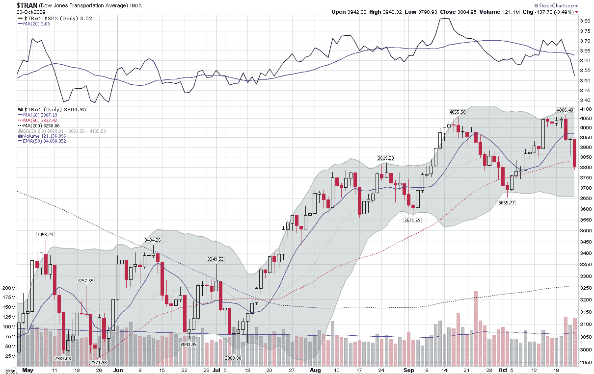

<!--yml

类别：未分类

日期：2024-05-18 17:25:18

-->

# 维克斯与更多：本周图表：下跌的运输业

> 来源：[`vixandmore.blogspot.com/2009/10/chart-of-week-falling-transports.html#0001-01-01`](http://vixandmore.blogspot.com/2009/10/chart-of-week-falling-transports.html#0001-01-01)

上周大部分时间，大多数主要市场指数都出现了温和的负面数字。然而，许多人在密切关注的一个指数受到了特别大的打击。道琼斯运输平均指数（[Dow Jones Transportation Average](http://en.wikipedia.org/wiki/Dow_Jones_Transportation_Average) ([DJTA](http://vixandmore.blogspot.com/search/label/DJTA)))，作为道氏理论的一个重要组成部分，当周下跌了 5.4%，尤其是在周五跌幅较大。

在周五市场开盘前，DJTA 中的三家铁路公司中有两家报告了收益情况。虽然底线数字令人印象深刻，但投资者们对大幅的收入下降感到恐慌。伯灵顿北方圣达菲铁路公司([BNI](http://vixandmore.blogspot.com/search/label/BNI))报告的季度收入比 2008 年同期下降了 27%，而联合太平洋铁路公司([UNP](http://vixandmore.blogspot.com/search/label/UNP))报告的同期收入下降了 24%。收入不佳的状况帮助推动 DJTA 在周五下跌了 3.5%，并在下方的本周图表中形成了看似暂定的双顶形态。

虽然我绝不是一个严格遵循道氏理论的人，但我确实认为运输业很重要，特别是当它传递出的经济信号与制造业部门报告的不一致时。运输业将是未来重要的观察领域。

*[来源：StockCharts]*
