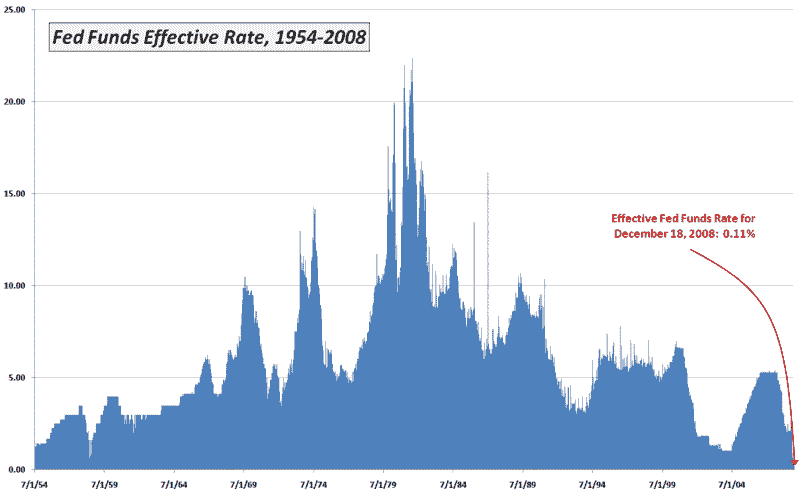

<!--yml

类别：未分类

日期：2024-05-18 18:09:51

-->

# 波动率指数与更多：本周图表：联邦基金利率降至 0.11%

> 来源：[`vixandmore.blogspot.com/2008/12/chart-of-week-fed-funds-rate-drops-to.html#0001-01-01`](http://vixandmore.blogspot.com/2008/12/chart-of-week-fed-funds-rate-drops-to.html#0001-01-01)

由于美联储决定将目标联邦基金利率降至前所未有的 0.00%至 0.25%，本周的[图表](http://vixandmore.blogspot.com/search/label/chart%20of%20the%20week)主题显而易见。

美联储拥有 55 年的联邦基金利率数据，我选择突出显示的不是联邦公开市场委员会（FOMC）宣布的目标利率，而是由主要经纪人安排的交易的日常有效联邦基金利率，这是一个交易量的加权平均利率。

不出所料，周五的有效联邦基金利率 0.11%创下了新低，但实际上这一纪录是在 12 月 10 日建立的，并在周五再次持平。

对于历史爱好者来说，22.36%的历史最高纪录可以追溯到 1981 年 7 月 22 日。自 1954 年以来，联邦基金利率的平均水平为 5.62%。

*[数据来源：美国联邦储备银行，波动率指数与更多]*
