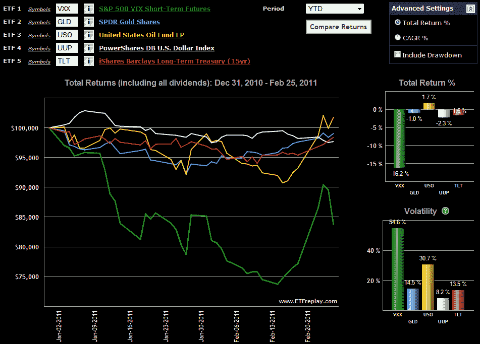

<!--yml

分类：未分类

date: 2024-05-18 16:53:13

-->

# VIX 和更多内容：图表 of the Week：Flight to Safety ETPs

> 来源：[`vixandmore.blogspot.com/2011/02/chart-of-week-flight-to-safety-etps.html#0001-01-01`](http://vixandmore.blogspot.com/2011/02/chart-of-week-flight-to-safety-etps.html#0001-01-01)

今年对市场情绪、波动性和金融市场地缘政治影响的研究者来说已经很有趣了。我们见证了各种规模和形式的革命，如突尼斯、埃及和利比亚，北非和中东的其他地方也发生了较小规模的起义。在很大程度上，股市的波动在利比亚革命之前相对平静，其对[原油](http://vixandmore.blogspot.com/search/label/crude%20oil)价格的影响也较为温和。

在本周的[图表](http://vixandmore.blogspot.com/search/label/chart%20of%20the%20week)中，我研究了五个在避险交易中至关重要的交易所交易产品(ETPs)今年以来的表现。它们包括波动性([VXX](http://vixandmore.blogspot.com/search/label/VXX)), 黄金([GLD](http://vixandmore.blogspot.com/search/label/GLD)), 原油([USO](http://vixandmore.blogspot.com/search/label/USO)), 美元([UUP](http://vixandmore.blogspot.com/search/label/UUP))和美国国债([TLT](http://vixandmore.blogspot.com/search/label/TLT))。

需要注意的是，除了原油，北非和中东的政治动荡并没有足够干扰这些交易，使其在 2011 年变得有利可图，尽管自 1 月 25 日埃及爆发暴力事件和 2 月 15 日利比亚开始动荡以来，这些交易的整体表现有所上升。VXX 图表很好地捕捉了 VXX 赌注的本质。即使在地缘政治动荡和原油价格上涨的情况下，这个 ETN 今年仍下跌了 16.2%。波动性的激增为 VXX 多头提供了非常短暂的利用市场焦虑加剧的机会，图表反映了这种 ETN 持续下降趋势和高波动性。*[顺便说一下，将[VXZ](http://vixandmore.blogspot.com/search/label/VXZ)与 VXX 进行交换的类似图表将显示出在表现上几乎没有差异。]*

所以下次你在地缘政治危机的背景下考虑做多波动性头寸时，请认真考虑一些其他的避险策略。

相关帖子：

来源：[ETFreplay.com]

****披露(s):*** *在撰写本文时持有 VXZ 多头头寸，持有 VXX、USO 和 TLT 空头头寸**
