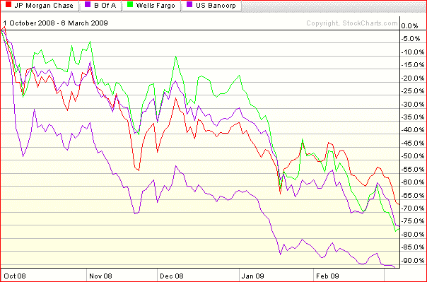

<!--yml

分类：未分类

日期：2024-05-18 17:56:50

-->

# VIX 和更多：本周图表：四家良好（？）银行

> 来源：[`vixandmore.blogspot.com/2009/03/chart-of-week-four-good-banks.html#0001-01-01`](http://vixandmore.blogspot.com/2009/03/chart-of-week-four-good-banks.html#0001-01-01)

我希望本周的[图表](http://vixandmore.blogspot.com/search/label/chart%20of%20the%20week)能有其他话题，但截至目前，银行是*唯一*的故事，任何一段时间忽视这一事实都可能带来麻烦。

不久前，摩根大通（[JPM](http://vixandmore.blogspot.com/search/label/JPM)）、美国银行（[BAC](http://vixandmore.blogspot.com/search/label/BAC)）、富国银行（[WFC](http://vixandmore.blogspot.com/search/label/WFC)）和美国银行公司（[USB](http://vixandmore.blogspot.com/search/label/USB)）还被树立为四个大型、相对强大的银行，预计将作为美国主导的大型银行从当前的金融危机中脱颖而出。

在这场游戏的这个阶段，美国银行显然陷入了困境，富国银行受到了越来越多的审查，即使是坚如磐石的摩根大通和美国银行公司的信心和股价也在迅速流失。股息削减和内部人购买对遏制价值毁灭的潮流几乎没有起到作用，奥巴马政府表示他们强烈支持银行私有化的评论，也没有带来更多的缓解。

下表展示了这些“良好”银行在雷曼兄弟破产后的表现。在那段时间里，摩根大通一直是该集团表现最好的银行，其市值损失了三分之二，而富国银行和美国银行公司的损失目前已超过 75%。在同一时期，美国银行市值下跌了超过 90%。

既然我提到了这个话题，我想指出全球金融刚刚编制了一份[世界 50 家最安全银行](http://www.gfmag.com/admin/mods/abmRepository/root/Docs/2009/safest_mid_year.pdf)的名单。名单上排名最高的美国银行是富国银行，排名第 21 位。美国银行公司排名第 26 位，摩根大通排名第 47 位，名单上唯一的其他美国银行是纽约梅隆银行([BK](http://vixandmore.blogspot.com/search/label/BK))，排名第 35 位。

*[来源：StockCharts]*
