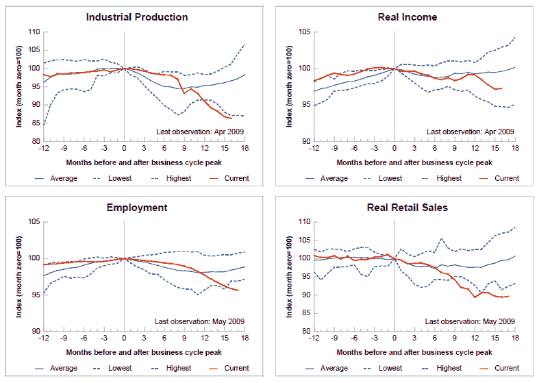

<!--yml

分类：未分类

date: 2024-05-18 17:42:52

-->

# 《VIX 和更多：图表一周：四个关键经济指标》

> 来源：[`vixandmore.blogspot.com/2009/06/chart-of-week-four-key-economic.html#0001-01-01`](http://vixandmore.blogspot.com/2009/06/chart-of-week-four-key-economic.html#0001-01-01)

第二个星期 consecutive，本周的[图表](http://vixandmore.blogspot.com/search/label/chart%20of%20the%20week)再次关注经济基本面。本周我展示了一幅来自[圣路易斯联邦储备银行](http://stlouisfed.org/)的图表，它试图用[工业生产](http://vixandmore.blogspot.com/search/label/industrial%20production)、实际收入、就业和[零售销售](http://vixandmore.blogspot.com/search/label/retail%20sales)来总结当前的经济衰退。

从 2007 年 12 月的商业周期高峰开始，下面的图表试图通过对每个统计数据分配一个 100 的指数值（以 2007 年 12 月的数值为准），来标准化和经济调整数据，以便更容易评估比较变化。请注意，对于每个系列，在先前商业周期高峰之后的每个月都绘制了平均值、高值和低值。对于工业生产、就业和实际零售销售，平均系列包括了从 1948 年 11 月商业周期高峰开始的 10 次衰退。对于实际收入，平均值从 1960 年 4 月的高峰开始。

在结论方面，当前的经济衰退正在创下工业生产、就业和零售销售的新低。有趣的是，尽管实际收入很低，但并没有接近历史低点。

请注意，在之前的衰退中，就业和零售销售通常现在已经开始反弹，而实际收入和工业生产则需要更长时间触底。

展望未来，有趣的是，这些指标还将持续多久创下新低，以及它们将在多久之后反弹到“平均衰退”的水平。

顺便说一下，对于那些寻找优秀的美联储原始经济数据仓库和一些本地图表功能的人来说，圣路易斯联邦储备银行的美联储经济数据（FRED）网站可能是你的首选。

来源：[圣路易斯联邦储备银行]
