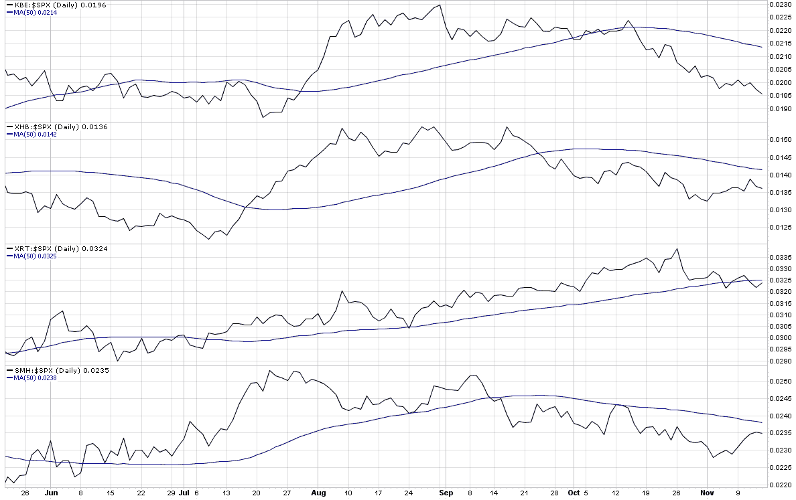

<!--yml

分类：未分类

日期：2024-05-18 17:22:33

-->

# VIX and More: 图表：四个关键行业挣扎

> 来源：[`vixandmore.blogspot.com/2009/11/chart-of-week-four-key-sectors-struggle.html#0001-01-01`](http://vixandmore.blogspot.com/2009/11/chart-of-week-four-key-sectors-struggle.html#0001-01-01)

虽然我仍然至少有一只脚坚定地站在多头阵营中，但我越来越担心一些关键技术指标发出的信号。 我关注的担忧列表顶端是[市场宽度](http://vixandmore.blogspot.com/search/label/breadth)， 衡量方法是[麦克莱兰累积指数](http://vixandmore.blogspot.com/search/label/McClellan%20Summation%20Index)和其他类似的市场宽度指标。 底线是，如果指数在少数股票上升的基础上继续强劲上涨，而大多数股票横向移动或下跌，那么反弹将难以维持自身。

在过去的几周里，有几个关键的[行业](http://vixandmore.blogspot.com/search/label/sectors)的表现逊于标普 500 指数，尤其是银行([KBE](http://vixandmore.blogspot.com/search/label/KBE)); 房屋建筑商([XHB](http://vixandmore.blogspot.com/search/label/XHB)); 零售商([XRT](http://vixandmore.blogspot.com/search/label/XRT)); 和半导体([SMH](http://vixandmore.blogspot.com/search/label/SMH)). 本周的[图表](http://vixandmore.blogspot.com/search/label/chart%20of%20the%20week)显示了这四个行业在过去六个月相对于标普 500 指数的表现。 在所有四个案例中，这些关键行业都低于它们与 SPX 的比率 50 天的平均值，在银行的情况下，相对表现差距几乎每天都在增加。

展望未来，我预计如果这四个行业继续在相对基础上表现不佳，那么主要市场指数（如 SPX）将难以创出新高。 为此，我将密切关注市场宽度，特别是这四个关键行业。

有关相关主题的额外文章，读者们可以查看：

*[来源：StockCharts]*
