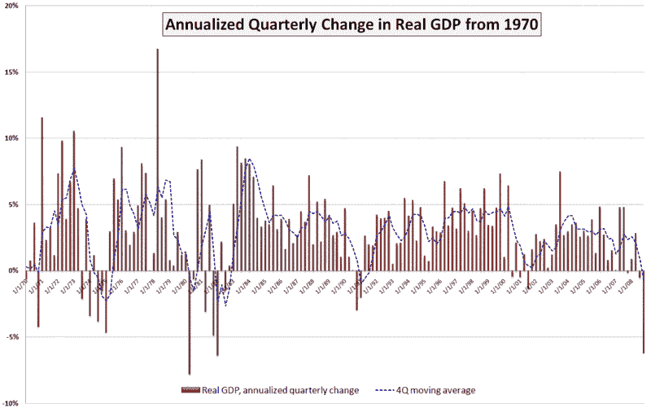

<!--yml

类别：未分类

日期：2024-05-18 17:57:38

-->

# VIX and More: Chart of the Week: GDP Worse Than Expected

> 来源：[`vixandmore.blogspot.com/2009/02/chart-of-week-gdp-worse-than-expected_28.html#0001-01-01`](http://vixandmore.blogspot.com/2009/02/chart-of-week-gdp-worse-than-expected_28.html#0001-01-01)

本周市场发生了很多事情：政府在花旗集团([C](http://vixandmore.blogspot.com/search/label/C))中获得了更大的所有权；道琼斯工业平均指数成分股中的摩根大通([JPM](http://vixandmore.blogspot.com/search/label/JPM))和通用电气([GE](http://vixandmore.blogspot.com/search/label/GE))都削减了他们的股息；耐用品和住房数据未能达到已经降低的预期；第四季度[GDP](http://vixandmore.blogspot.com/search/label/GDP)修订后下降了 6.2%；标普 500 指数跌至 1996 年以来的最低水平。

尽管所有这些打击，市场表现得相对稳定，除了 GDP 数据，它在周五早上给市场带来了致命一击。GDP 数字以名符其实的回顾性著称，而对 GDP 数据的修订对现有的经济知识体系贡献很少。话说回来，周五的 GDP 数字触动了市场的统计和心理神经，市场还没有准备好消化经济下滑有多严重。

这周的[图表一周](http://vixandmore.blogspot.com/search/label/chart%20of%20the%20week)试图将最新的 GDP 数字放在历史背景下。虽然图表中没有显示，但 2008 年第四季度的原始 GDP 大约是 2007 年 6 月经济活动水平的水平。另外，虽然第四季度 GDP 下降了 6.2%（年度化），这非常令人担忧，但它比我们看到的 1982 年第一季度（-6.4%）和 1980 年第二季度（-7.8%）的下降要小。再往前追溯（图表上没有显示），1958 年第一季度 GDP 下降了惊人的 10.4%。

我已经添加了一条虚线蓝线来显示 GDP 的四季度移动平均值。按照这一标准，当前情况还有很长的路要走，才能与 1991 年相比，更不用说 1970 年代和 1980 年代在上文提到的更大的四季度跌幅了。

两周前，费城联邦储备银行发布的一项对 43 位经济预测师的调查显示，他们预计 2009 年第一季度 GDP 将下降 5.2%，第二季度将下降 1.8%。鉴于对第四季度数据的最新修订，当前季度下降 5.2%可能过于乐观，但现在的问题是第三季度能否显示出任何增长——或者至少是经济恶化速度的放缓。

来源：[美国经济分析局，VIXandMore]
