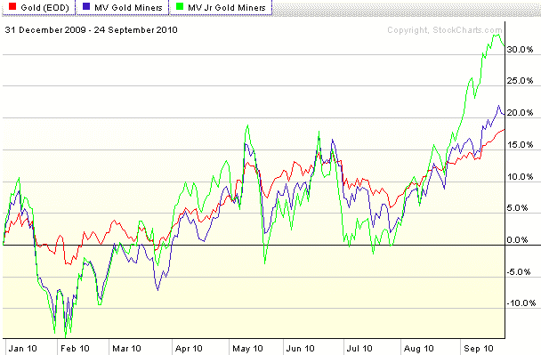

<!--yml

类别：未分类

日期：2024-05-18 17:02:37

-->

# VIX and More: 图表一周：黄金和矿工

> 来源：[`vixandmore.blogspot.com/2010/09/chart-of-week-gold-and-miners.html#0001-01-01`](http://vixandmore.blogspot.com/2010/09/chart-of-week-gold-and-miners.html#0001-01-01)

从技术角度来看，上周市场上的一大事件无疑是标普 500 指数的突破，但既然我花了这么多时间在 SPX 及其衍生品上，我认为现在是时候认识到[黄金](http://vixandmore.blogspot.com/search/label/gold)达到新的历史高点，并触及每盎司 1300 美元的重要性了。

为了从一个稍微不同的角度看待黄金，在下面的[本周图表](http://vixandmore.blogspot.com/search/label/chart%20of%20the%20week)中，我选择包括了黄金期货连续合约（红线）以及两个黄金矿工的流行 ETF：[GDX](http://vixandmore.blogspot.com/search/label/GDX)，大型市值版本（持有[ABX](http://vixandmore.blogspot.com/search/label/ABX)、[GG](http://vixandmore.blogspot.com/search/label/GG)和[NEM](http://vixandmore.blogspot.com/search/label/NEM)的顶部持股，如下蓝线所示）；和[GDXJ](http://vixandmore.blogspot.com/search/label/GDXJ)，小型黄金矿工 ETF（绿线。）

如 2010 年表现图所示，黄金期货是该组中最稳定的，表现与 GDX 大致相同。尽管 GDX 和 GDXJ 跟踪得相当紧密，但请注意，GDXJ 在过去一个月左右的表现上已经区分了自己，表现更优。

预测黄金的未来是一项艰巨的任务，但如果看涨趋势持续下去，GDXJ 显然有潜力继续带来超额回报——当然，风险也是相应的。

相关文章：

来源：StockCharts.com

****披露(s):*** *在撰写本文时持有 GDXJ*
