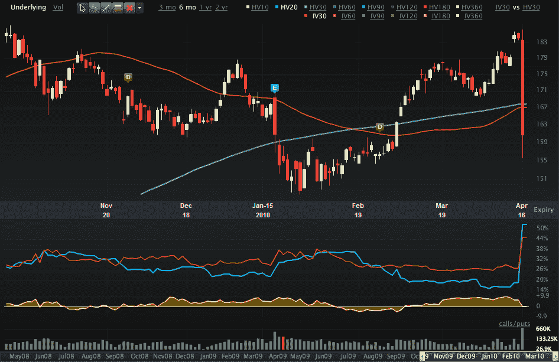

<!--yml

分类：未分类

日期：2024-05-18 17:11:38

-->

# VIX and More: 图表：高盛

> 来源：[`vixandmore.blogspot.com/2010/04/chart-of-week-goldman-sachs.html#0001-01-01`](http://vixandmore.blogspot.com/2010/04/chart-of-week-goldman-sachs.html#0001-01-01)

没有理由在本周的[图表](http://vixandmore.blogspot.com/search/label/chart%20of%20the%20week)中搞得太复杂。本周的大新闻是高盛（Goldman Sachs，[GS](http://vixandmore.blogspot.com/search/label/GS)）被指控欺诈，美国证券交易委员会（SEC）称高盛在某些抵押债务工具（CDO）的选择过程中进行了误导，导致 10 亿美元的欺诈行为。

下面的图表捕捉了高盛（GS）过去六个月的股价走势，并显示了上周五的抛售如何抹去了该股票过去三个月的大部分涨幅。特别值得注意的是，[历史波动率](http://vixandmore.blogspot.com/search/label/historical%20volatility)（HV20）和[隐含波动率](http://vixandmore.blogspot.com/search/label/implied%20volatility)（IV30）都出现了激增，其中历史波动率现在超过了其前瞻性隐含波动率的对手。由于波动性较高，期权交易员目前非常喜欢高盛（GS），无论他们是否在思考高盛股票未来的走势，还是在寻找出售期权以获取额外溢价的机会。

请注意，高盛（Goldman）计划在周二市场开盘前报告收益。

关于相关主题的更多信息，读者们被鼓励去查看：

来源：[Livevol Pro]

***披露(s):*** *Livevol 是 VIX 和 More 的广告商*
