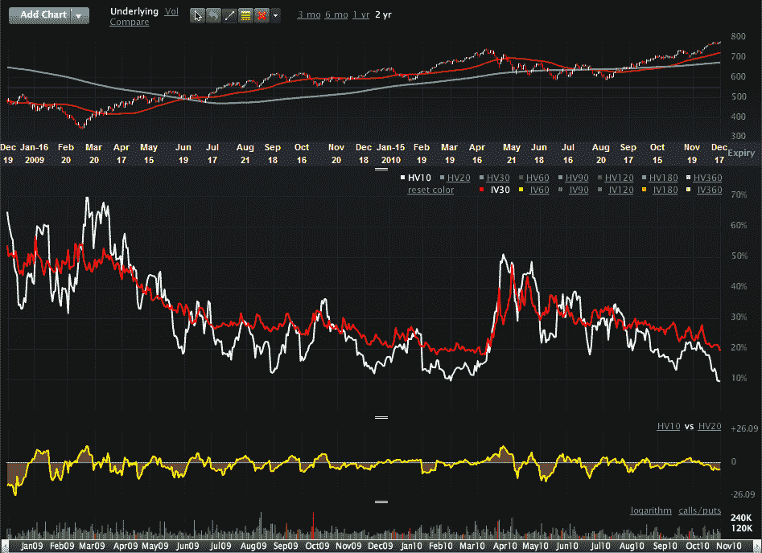

<!--yml

类别：未分类

日期：2024-05-18 16:56:00

-->

# VIX 和 More: 图表一周：历史波动率在季节性低迷中暴跌

> 来源：[`vixandmore.blogspot.com/2010/12/chart-of-week-historical-volatility.html#0001-01-01`](http://vixandmore.blogspot.com/2010/12/chart-of-week-historical-volatility.html#0001-01-01)

这是年度[假期效应](http://vixandmore.blogspot.com/search/label/Holiday%20Effect)的季节，其中历史波动率（HV）有强烈的倾向暴跌，并将其隐含波动率（IV）一同拉低。这是一个我过去多次探讨过的主题（见下面的链接），实际上这只是我所说的[日历反转](http://vixandmore.blogspot.com/search/label/calendar%20reversion)的较长版本——VIX 因市场制造商在周末前调整价格而额外下跌 1%左右的倾向。波动性的所有根源都可以归结为同一个原因：在 VIX（和隐含波动率）指定的 30 个日历日内交易日较少，这意味着股票偏离有效市场、标准差和其他正常规则所预测的路径的机会较少。

截至周五收盘，标普 500 指数的历史波动率为 5.5，这是自 2007 年 5 月以来的最低读数。在本周的[图表一周](http://vixandmore.blogspot.com/search/label/chart%20of%20the%20week)下面，我选择显示 Russell 2000 小盘股指数（[RUT](http://vixandmore.blogspot.com/search/label/RUT)）的 10 日历史波动率，该指数的传统波动率高于 SPX，并且更容易受到经济变化和不确定性的影响。如图所示，10 日历史波动率（白线）处于两年低点，并有助于将指数的隐含波动率（红线）拉低至 20 以下。请注意，上周 CBOE Russell 2000 波动指数([RVX](http://vixandmore.blogspot.com/search/label/RVX))一度跌至 19.55，并威胁要跌破自 2007 年 6 月以来的首次 19.00 水平。

新年伊始，我预计会看到假期效应神奇地消失，HV、IV 和波动性指数开始反映投资者预期更为准确的观点。

相关文章：

*[来源: Livevol.com]*

****披露(s):*** *Livevol 是 VIX 和 More 的广告商**
