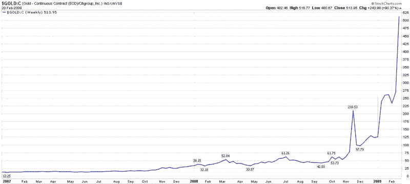

<!--yml

分类：未分类

日期：2024-05-18 17:58:34

-->

# VIX and More: 周图表系列：我的黄金能换多少花旗集团股票？

> 来源：[`vixandmore.blogspot.com/2009/02/chart-of-week-how-much-citigroup-for-my.html#0001-01-01`](http://vixandmore.blogspot.com/2009/02/chart-of-week-how-much-citigroup-for-my.html#0001-01-01)

在 2001 年，想要用他的黄金条块交换花旗集团([C](http://vixandmore.blogspot.com/search/label/C))股票的投资者，每盎司黄金能够获得大约六股股票。随着花旗集团昨日收盘价接近 2.00，并且黄金价格超过 1000.00，同样的交换现在让黄金持有者有权获得大约 514 股花旗集团股票。

财富的变化更多地反映了花旗集团，自 2007 年初以来下跌了约 96%，而不是黄金，黄金自 2001 年的低点上涨了约 300%。

本周的[周图表](http://vixandmore.blogspot.com/search/label/chart%20of%20the%20week)追踪了黄金连续合约期货与花旗集团股票价格的比例，基本上跟踪了自 2007 年初以来花旗集团在黄金中的汇率。在许多方面，这张图表也是美国银行系统面临问题规模的优秀代理。

**作为旁注，现在三个月大的，*VIX and More* 周图表系列的完整历史可以通过点击[周图表](http://vixandmore.blogspot.com/search/label/chart%20of%20the%20week)链接找到。**

*[数据来源：StockCharts]*
