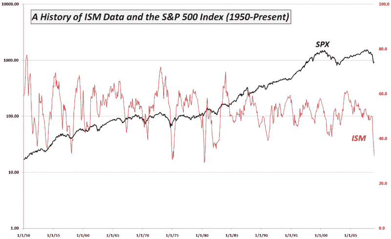

<!--yml

类别：未分类

日期：2024-05-18 18:08:02

-->

# VIX 和更多：本周图表：ISM 暴跌

> 来源：[`vixandmore.blogspot.com/2009/01/chart-of-week-ism-plummets.html#0001-01-01`](http://vixandmore.blogspot.com/2009/01/chart-of-week-ism-plummets.html#0001-01-01)

股市可能已经摆脱了去年 12 月[ISM](http://vixandmore.blogspot.com/search/label/ISM)的 32.4 这个数字，但投资者应该记住，在 ISM 指数 61 年的历史中，只有前三场衰退（1949 年、1974-1975 年和 1980 年）的 ISM 数字更低。比制造业指数数字更令人担忧的是，新订单现在比数据 60 年的历史中的任何时候都要低。[报告](http://www.ism.ws/ISMReport/MfgROB.cfm)

本周图表如下，捕捉了自 1950 以来的 ISM 和 SPX。除了 9 月份开始的明显悬崖跳水之外，我还发现自 2004 年 5 月达到高点以来，制造业指数一直在缓慢下降很有趣。

顺便说一下，在 2009 年，我打算在博客上为宏观经济问题（特别是住宅、制造业和消费者支出）预留更多的空间，同时也会关注那些塑造地缘政治和经济格局的全球事件。

来源：[供应链管理协会，VIX 和更多](http://vixandmore.blogspot.com/2009/01/chart-of-week-ism-plummets.html#0001-01-01)
