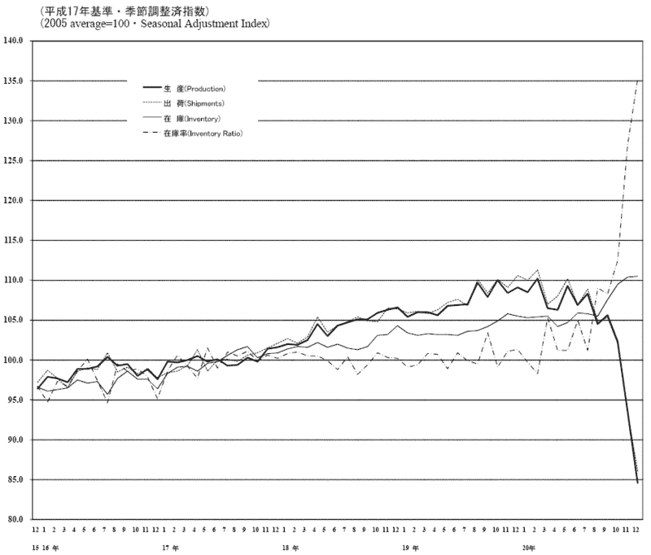

<!--yml

分类：未分类

date: 2024-05-18 18:02:31

-->

# VIX 和更多：本周图表：日本的工业生产

> 来源：[`vixandmore.blogspot.com/2009/01/chart-of-week-industrial-production-in.html#0001-01-01`](http://vixandmore.blogspot.com/2009/01/chart-of-week-industrial-production-in.html#0001-01-01)

在美国第四季度 GDP 下降 3.8%的喧嚣和两周前工业生产下降 2.0%的报道中，提醒我的主要关注美国的观众，事情在国外要糟糕得多，尤其是在亚洲。

在本周，日本报告称 12 月工业生产下降了 9.6%，韩国报告称 12 月下降了 18.6%。无论选择与美国数据还是历史数据集进行比较，这些都是惊人的数字。

在本周的[图表一周](http://vixandmore.blogspot.com/search/label/chart%20of%20the%20week)中，我选择比较了 2003 年 12 月至 2008 年 12 月的日本工业生产数据，部分原因是我喜欢日文字符的外观，部分原因是因为它展示了 2008 年第四季度日本出口经济如何急剧下降。

快速下降的工业生产可能是亚洲对美国的下一个主要出口。

来源：[日本经济产业省](http://vixandmore.blogspot.com/2009/01/chart-of-week-industrial-production-in.html#0001-01-01)
