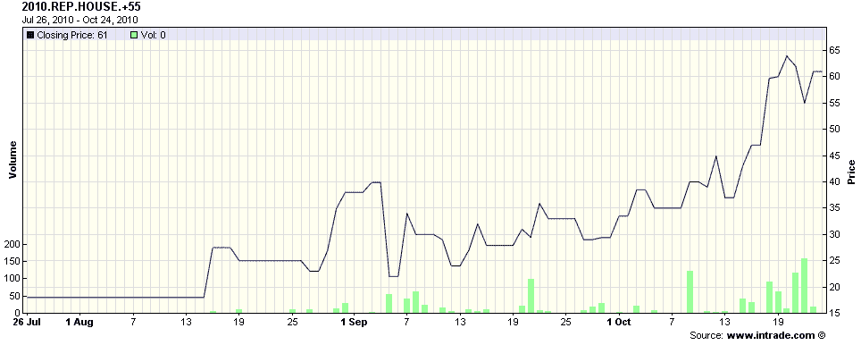

<!--yml

类别：未分类

日期：2024-05-18 17:00:22

-->

# VIX and More: Chart of the Week: Intrade and the Midterm Elections

> 来源：[`vixandmore.blogspot.com/2010/10/chart-of-week-intrade-and-midterm.html#0001-01-01`](http://vixandmore.blogspot.com/2010/10/chart-of-week-intrade-and-midterm.html#0001-01-01)

三个月前在[Chart of the Week: Intrade and Control of the House of Representatives](http://vixandmore.blogspot.com/2010/07/chart-of-week-intrade-and-control-of.html)中，我使用了一个[Intrade.com](http://www.intrade.com/)合同作为[本周图表](http://vixandmore.blogspot.com/search/label/chart%20of%20the%20week)，来说明市场是如何为即将到来的 11 月 2 日的选举后共和党是否会控制众议院分配概率的。当时，那个合同的最后交易价为 55.1，大致相当于共和党控制的 55.1%的概率。

投票日两周零两天前，同样的合同的交易价格为 90，这意味着市场认为共和党在选举后会控制众议院的可能性大约为 90%。在这个阶段，更为关键的问题是如何 many seats the Democrats will retain in the Senate and just how many seats the Republicans will gain in the House. The contracts covering the House gains are issued in increments of five seat strikes, so that there are separate contracts for a gain of 50 or more seats, 55 or more, 60 or more, etc. Right now the most active trading can be found in the at-the-money contracts, with the +55 seat contract last quoted at 57.9 bid and 61.8 ask, while the +60 seat contract last quoted at 38.1 bid and 43.8 ask.

下面的图表，来自[Intrade](http://vixandmore.blogspot.com/search/label/Intrade)，追踪了过去 90 天内+55 席位的合同的交易情况。请注意，这个合同在一个星期前的今天越过了 50 的门槛，并且最后交易价为 61。观察各种合同，在合同之前，交易超过 50 的最高席位数是+45 席。在十月的第二周，+50 和+55 席位的合同都上升到了 50 以上。随着最近对+60 席位的合同的激烈投注以及其在过去一个月内价格翻倍，看起来这个合同将是观察权力平衡向共和党倾斜程度的一个很好的指标。

正如我上次提到的，对于那些对选举的逐席、逐民调的视角感兴趣的人来说，[RealClearPolitics.com](http://realclearpolitics.com/)是一个很好的起点。像我这样更关心为整体结果分配概率的人可能会更愿意关注[Intrade.com](http://www.intrade.com/)，这个流行的[预测市场](http://vixandmore.blogspot.com/search/label/prediction%20markets)网站。

最后，这可能是个显而易见的事实，但不要惊讶于发现预期中的共和党席位增减与股市之间存在关系。

相关文章：

来源：[Intrade.com]

****披露信息：*** 无
