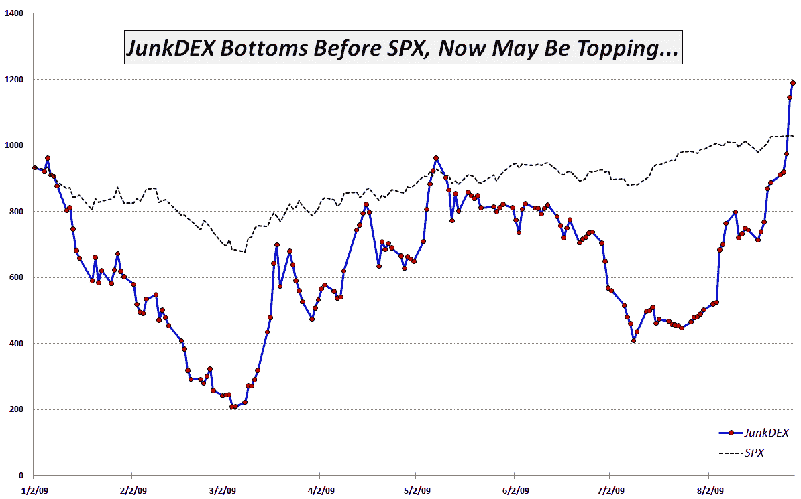

<!--yml

分类：未分类

日期：2024-05-18 17:31:38

-->

# VIX 和更多：本周图表：JunkDEX 追踪垃圾金融的投机狂潮

> 来源：[`vixandmore.blogspot.com/2009/08/junkdex-tracks-speculative-frenzy-in.html#0001-01-01`](http://vixandmore.blogspot.com/2009/08/junkdex-tracks-speculative-frenzy-in.html#0001-01-01)

回到 2007 年 9 月，当时我认为市场有些过于繁荣，我创建了一个[过度成熟的高飞股票](http://vixandmore.blogspot.com/search/label/Overripe%20High%20Fliers)的列表。几周后，在[从过度成熟到脆弱？](http://vixandmore.blogspot.com/2007/10/from-overripe-to-vulnerable.html)中，我将当时引起大量投机关注的 14 只过度成熟的高飞股票列表转化为我称之为[OHFDEX](http://vixandmore.blogspot.com/search/label/OHFdex)的东西——一个基于这些过度成熟的高飞股票的指数。

不仅 OHFDEX 的时机完美，该文章也非常受欢迎，以至于催生了许多后续文章，包括[OHFDEX 一年后](http://vixandmore.blogspot.com/2008/10/ohfdex-one-year-later.html)。

秉承原始 OHFDEX 的精神，我一直密切关注最近某些被称为“[垃圾金融](http://vixandmore.blogspot.com/search/label/junk%20financials)”的股票的投机狂潮。这些是[金融公司](http://vixandmore.blogspot.com/search/label/financials)，在金融危机期间接受了政府救助资金，现在的估值远低于 2007 年的水平。它们包括美国国际集团([AIG](http://vixandmore.blogspot.com/search/label/AIG)), 房利美([FNM](http://vixandmore.blogspot.com/search/label/FNM)), 房地美([FRE](http://vixandmore.blogspot.com/search/label/FRE)), 花旗集团([C](http://vixandmore.blogspot.com/search/label/C)), CIT 集团([CIT](http://vixandmore.blogspot.com/search/label/CIT))和 Bank of America([BAC](http://vixandmore.blogspot.com/search/label/BAC))。在过去的几周里，这些股票通常占到纽约证券交易所总交易量的 30%以上，仅上周五，这六家公司就交易了 25.3 亿股。

虽然我认为投资者从风险规避行为转向风险容忍行为是疗愈过程中的一个重要步骤，但近期冒险寻求行为的盲目涌入让我感到相当不安。当六个月前几乎破产的六家公司的投机行为现在占到每天交易的三分之一股票时，市场还能健康吗？

为了跟踪垃圾金融的投机兴趣，我创建了一个我称之为[JunkDEX](http://vixandmore.blogspot.com/search/label/JunkDEX)的东西，它由截至 2009 年 1 月 2 日等权重的 AIG、FNM、C、CIT 和 BAC（我选择省略 FRE，因为它与 FNM 有很强的相似性）组成。我将 JunkDEX 的规模调整到与年初的 SPX 相同。如下图所示，JunkDEX 在 1 月到 3 月期间领先标普 500 指数下跌，底部提前两天出现，并在 5 月中旬显著反弹。从 5 月到 8 月初，JunkDEX 明显落后于 SPX，然后在过去的 3 个半月里急剧飙升。

JunkDEX 似乎正在接近一个顶部放量的情况。如果确实如此，我认为它将像 OHFDEX 一样，预示着大盘即将见顶。

展望未来，我将关注垃圾金融投机活动的动向以及 JunkDEX 的情况，以寻找近期牛市能否持续的线索。我会适时更新 JunkDEX 的表现，并建议交易者无论是做多还是做空这些股票，都应格外小心。

**[图片：VIXandMore]**

***[披露：在撰写本文时持有 AIG 的空头仓位]***
