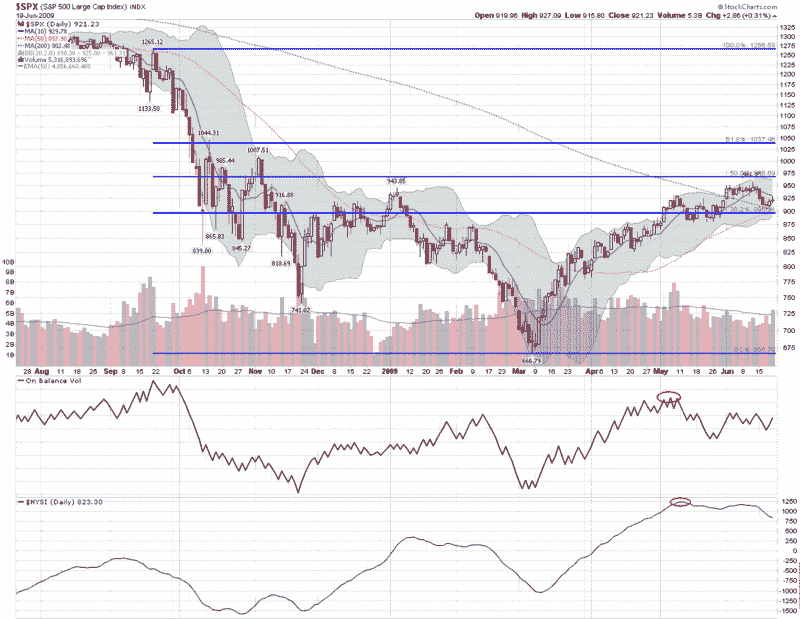

<!--yml

分类: 未分类

日期: 2024-05-18 17:41:49

-->

# VIX and More: Chart of the Week: Lack of Volume and Breadth Threatens Bull Move

> 来源：[`vixandmore.blogspot.com/2009/06/chart-of-week-lack-of-volume-and.html#0001-01-01`](http://vixandmore.blogspot.com/2009/06/chart-of-week-lack-of-volume-and.html#0001-01-01)

在过去几周里，股市难以扩大近期涨幅，受到的冲击更多是来自缺乏购买兴趣，而不是卖方压力。

下面的[本周图表](http://vixandmore.blogspot.com/search/label/chart%20of%20the%20week)尝试使用两个基本指标来捕捉自 3 月份中旬至 6 月份的上涨行情中所受的成交量不足和市场广度不足的问题。作为市场成交量的衡量指标，我选择突出显示[平衡成交量](http://vixandmore.blogspot.com/search/label/on%20balance%20volume)（OBV），即上涨日的成交量减去下跌日的成交量的累计值。这个指标非常擅长于突出因成交量下降而面临风险的趋势，这正是 5 月初两周 OBV 达到峰值时所暗示的警告。

类似地，[麦克莱伦广度指数](http://vixandmore.blogspot.com/search/label/McClellan%20Summation%20Index)（又名纽约证券交易所广度指数或 NYSI）显示的是由每日净上涨股票减去下跌股票得出的市场广度。麦克莱伦广度指数在 2 月底结束下跌前确实有所上升，通常这是一个非常出色的工具，用于衡量市场广度的趋势。

除了 5 月份的高点外，请注意 OBV 和麦克莱伦广度指数（McClellan Summation Index）最近也创下了较低的高点。虽然 OBV 显示出在当前水平稳定的迹象，但更大的担忧是麦克莱伦广度指数所显示的市场广度问题下降。

像所有指标一样，这两个指标并不完美，但它们通常能提供关于主要趋势减弱和反转的重要信息。

关于上述主题的更多信息，请尝试：

[图片: StockCharts]
