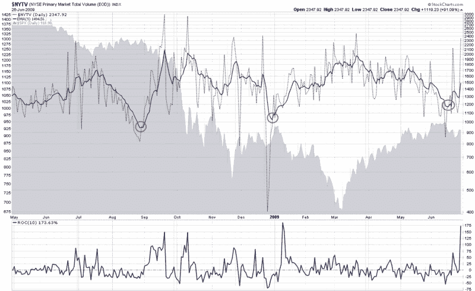

<!--yml

类别：未分类

日期：2024 年 5 月 18 日 17:41:02

-->

# VIX and More: 本周图表：最近的成交量底部是否会使股市陷入困境？

> 来源：[`vixandmore.blogspot.com/2009/06/chart-of-week-might-recent-volume.html#0001-01-01`](http://vixandmore.blogspot.com/2009/06/chart-of-week-might-recent-volume.html#0001-01-01)

本周的[图表](http://vixandmore.blogspot.com/search/label/chart%20of%20the%20week)很容易记录了近期波动率的下降，但这是许多评论员已经反复讨论过的故事，所以现在是时候换个话题了。比如成交量。

关于成交量的故事很少有机会得到充分的关注，因此我挑选了一张图表，希望引起一些讨论。

在[StockCharts](http://stockcharts.com/)的词汇中，$NYTV 是[几个度量标准](http://support.stockcharts.com/forums/29738/entries/35319)之一，用于衡量纽约证券交易所的交易量。具体来说，它是由[《华尔街日报》](http://online.wsj.com/mdc/public/page/mdc_us_stocks.html?mod=mdc_topnav_2_3002)报告的每日纽约证券交易所的交易量，并且是我选择用于自己图表的标准。下面的图表使用 NYTV 数据绘制了纽约证券交易所的总交易量（点状黑线），背景是 SPX 的实心灰色区域图表，数据追溯到 2008 年 5 月。为了平滑一些波动和假日引起的交易量下降，我添加了一个 9 天的指数移动平均线（EMA）作为实线蓝线。我还在主图表下面包括了一个 10 天的变化率（ROC）研究。

尽管读者无疑会从图表中得出自己的结论，但我选择突出显示 9 天成交量 EMA 中的三个底部。第一个出现在 2008 年 8 月底，就在雷曼引发的 9 月暴跌之前。第二个底部是从 12 月底开始的，就在 1 月份的顶峰之前。随着上周五由罗素指数再平衡引发的成交量激增，成交量的激增几乎可以肯定地证实，六月中旬的成交量枯竭现在将成为另一个底部。成交量的下降与 SPX 最近的顶峰相吻合，可能在 1 年半内第三次，成交量底部可能预示着 SPX 的多个月下跌。

*[来源：StockCharts]*
