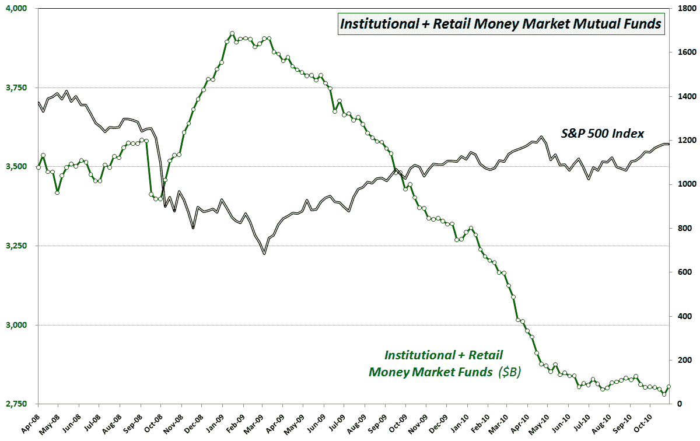

<!--yml

分类：未分类

日期：2024-05-18 16:59:45

-->

# VIX and More: Chart of the Week: Money Market Mutual Funds

> 来源：[`vixandmore.blogspot.com/2010/10/chart-of-week-money-market-mutual-funds.html#0001-01-01`](http://vixandmore.blogspot.com/2010/10/chart-of-week-money-market-mutual-funds.html#0001-01-01)

当这个星期的第一版[图表](http://vixandmore.blogspot.com/search/label/chart%20of%20the%20week)首次出现在博客中的[图表 of the Week: Change of Trend in Cash Holdings?](http://vixandmore.blogspot.com/2009/01/chart-of-week-change-of-trend-in-cash.html)于 2009 年 1 月时，它引发了不少争议。2009 年 3 月的一篇后续文章[Cash on the Sidelines Headed Back to Stocks?](http://vixandmore.blogspot.com/2009/03/cash-on-sidelines-headed-back-to-stocks.html)似乎也将这里的一些读者分化了。

回顾起来，投资公司研究所（ICI）的这些数据以及 AMG 数据服务公司的类似数据在追踪资金流入和流出现金方面做得非常出色，因此它们在很大程度上是净需求变化的良好代表。

在下面的图表中，请注意，货币市场共同基金资产在 2009 年 3 月中旬开始急剧下降（在 2009 年 1 月达到顶峰后，)正是在股票触底并开始获得买入的时候。在股票触底后的二十个月里，货币市场共同基金的净变化一直是股票需求的稳固同时和有时领先指标。

我再次翻出这张图表有几个原因，其中最不重要的是，自 4 月底以来，股票达到 2010 年的高点以来，货币市场共同基金的下降已经大幅减缓。此外，上周货币市场共同基金增加了 250 亿美元，这是自 2009 年 7 月以来的最大增幅，也是自 2009 年 1 月以来的第二大增幅。虽然这可能意味着什么，但我喜欢用这类图表挑衅。读者至少应该对大多数[现金在边际](http://vixandmore.blogspot.com/search/label/cash%20on%20the%20sidelines)最终已经投入到股票市场的可能性持开放态度。或许债券价格的显著下跌会让下一大笔资金流入股市。

无论如何，我认为这张货币市场共同基金的图表仍需进一步关注。

相关文章：

*[来源：投资公司研究所]*

****披露(s):*** *无**
